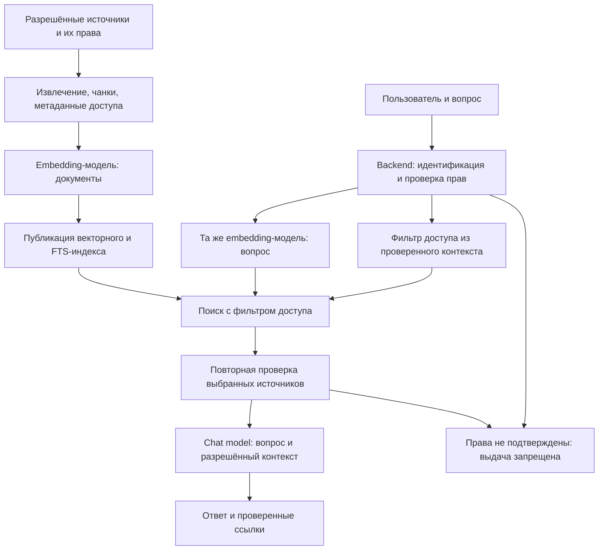

# RAG Support Chat — спецификация и порядок реализации

## Статус и область действия

Документ описывает **планируемое расширение**, а не реализованную возможность AutoBI.
Целевой дизайн закреплён в [ADR-019](12-architecture-decisions.md#adr-019--rag-support-chat).
Начало реализации требует задачи, охватывающей RAG, и включения этапа с зависимостями и exit criteria
в [roadmap](../roadmap/ROADMAP.md). Этот документ не меняет порядок и статус существующих фаз.

Профильные правила: [DDD](04-backend-laravel-ddd.md), [contexts и RBAC](05-bounded-contexts.md),
[API](07-api-and-integration.md), [очереди](08-events-outbox-async.md),
[инфраструктура](09-infrastructure-deployment-observability.md), [тестирование](10-testing-and-quality.md).
Пути ниже соответствуют структуре репозитория: `backend/`, `frontend/`, `contracts/`, `infra/`.

## Что такое RAG

**RAG (Retrieval-Augmented Generation)** — генерация ответа с дополнением найденным контекстом.
Система ограничивает поиск доступными пользователю документами, находит подходящие фрагменты
и передаёт разрешённый текст вместе с вопросом в языковую модель. Весь корпус в prompt не помещается;
обновление базы знаний происходит через индексацию документов, без переобучения модели ответа.

| Компонент                   | Назначение                                                                        |
| --------------------------- | --------------------------------------------------------------------------------- |
| Чанк                        | Фрагмент документа с текстом, происхождением и унаследованными правами доступа    |
| Embedding-модель            | Преобразует чанки и поисковый вопрос в числовые векторы для сравнения по смыслу   |
| Векторное хранилище         | Хранит embeddings и позволяет искать близкие векторы с ограничениями доступа      |
| Retrieval                   | Выбирает релевантные разрешённые чанки; в AutoBI семантический поиск дополнен FTS |
| Модель ответа (`ChatModel`) | Получает вопрос и найденный текст, формирует ответ со ссылками на источники       |

**Одна и та же embedding-модель и совместимый profile используются для чанков и вопроса.**
Profile фиксирует версию модели, размерность, нормализацию и предусмотренные моделью режимы
document/query. Совпадения размерности недостаточно для совместимости векторов.
Embedding-модель участвует в поиске; текст ответа создаёт отдельная chat model, которая
не обязана совпадать с ней или использовать того же провайдера.

Семантический поиск может найти инструкцию «Настройка порогов алертов» по вопросу
«Как узнать, что товар заканчивается?», даже без точного совпадения слов. Близость векторов
помогает выбрать кандидата на релевантный источник, но не подтверждает факт или право доступа.

Два потока разделены: подготовка знаний выполняется в фоне, поиск — для конкретного пользователя.



**Безопасность обеспечивается вокруг LLM:** backend ограничивает поиск и передачу данных.
Инструкция в prompt «не показывать секретные документы» не является механизмом авторизации.
Недоступные пользователю документы не должны попадать в контекст модели, даже если она могла бы
скрыть их в ответе. Этот принцип применяется и к будущему reranker или другим AI-компонентам.

## Цель и границы MVP

Чат помогает пользователю разобраться в возможностях BI-платформы, настройках, интерфейсе,
методологии показателей и типичных ошибках по опубликованной документации AutoBI.
MVP отвечает по документации/FAQ; он не получает фактические продажи, остатки или другие данные
workspace, не выполняет SQL и не изменяет ресурсы платформы. На вопрос о конкретных бизнес-данных
он объясняет ограничение и, при наличии источника, указывает нужный отчёт.

Стек: Next.js UI, Laravel DDD, PostgreSQL с pgvector и FTS, Laravel Queue, HTTP JSON + SSE.
Не добавлять Python/FastAPI, отдельную vector DB, LangChain, GraphRAG или агентный runtime.
В исходном определении Qdrant — пример векторной базы с фильтрацией по payload. В AutoBI ту же
роль выполняет pgvector вместе с таблицами метаданных PostgreSQL; выбор закреплён в ADR-019.
RAG не требует конкретной векторной БД. Смена хранилища потребует отдельного обоснования.

В MVP входят общая база знаний, приватные диалоги, streaming, сохранение истории,
восстановление соединения, citations, feedback, лимиты и оценка качества.
Приватные документы организаций, PDF/DOCX, внешние коннекторы, reranking, query rewriting,
conversation-aware retrieval и tool calling относятся к отдельным расширениям.

## Вопросы проектирования и принятые решения

Перед подключением каждого источника зафиксировать следующие ответы. Для MVP они заданы ниже;
для корпоративных источников это обязательный вход в проектирование следующего этапа.

| Вопрос                                   | MVP AutoBI                                                                                         | Требование для приватных источников                                                                |
| ---------------------------------------- | -------------------------------------------------------------------------------------------------- | -------------------------------------------------------------------------------------------------- |
| Какие данные подключены и кому доступны? | Явно опубликованные Markdown/FAQ AutoBI, общие для пользователей чата                              | Реестр источников, владельцы, категории данных и модель доступа каждого источника                  |
| Где идентифицируется пользователь?       | Laravel проверяет Sanctum Bearer token, переданный существующим Next.js BFF, и выбранный workspace | Связать проверенную identity с пользователем и группами источника; не доверять IDs из тела запроса |
| Где определены права документов?         | Manifest публикации и актуальный статус документа в `KnowledgeBase`                                | Исходная система, например Confluence, остаётся источником истины для документных ACL              |
| Как права попадают в индекс?             | Явные `scope = global`, `workspace_id = null`, версия политики и статус публикации                 | Нормализованная документная политика, её версия и связь каждого чанка с ней                        |
| Где применяется фильтр безопасности?     | В `KnowledgeBase`, в обеих SQL-ветках до ограничения кандидатов; повторная проверка перед LLM      | На поисковой границе, до передачи текста в `Support`, reranker или LLM                             |
| Возможен ли pre-filtering?               | Да: exact vector search и FTS среди разрешённых документов                                         | Предпочтителен pre-filtering; сложные ACL допускают отдельно проверенную гибридную схему           |
| Что при недоступности авторизации?       | Fail closed: остановить выдачу с безопасной ошибкой                                                | То же правило для внешнего сервиса, неизвестных прав и недостоверной синхронизации ACL             |

## Архитектурные границы

Два новых bounded context размещаются внутри существующего analytics-service:

| Context                    | Владение и ответственность                                                                   |
| -------------------------- | -------------------------------------------------------------------------------------------- |
| `Support`                  | Диалоги, сообщения, попытки генерации, feedback, orchestration RAG, лимиты генераций и usage |
| `KnowledgeBase`            | Источники, версии документов, чанки, embeddings, публикация индекса и retrieval              |
| `Workspace` (существующий) | Членство, роли, capabilities и проверенный контекст доступа                                  |

`Support` вызывает публичный application-порт retrieval в `KnowledgeBase` с проверенным контекстом
доступа, вопросом и бюджетом. Результат — DTO разрешённых фрагментов с происхождением, версиями
и оценками; прямое чтение чужих Eloquent-моделей запрещено. `KnowledgeBase` не зависит от диалогов.
Оба context используют публичные контракты `Workspace`, не дублируя ролевые правила.
`Workspace` подтверждает доступ к чату; `KnowledgeBase` применяет правила чтения документов.
Роль в AutoBI сама по себе не даёт права на материалы внешней системы.
Внешний authorization service при подключении источников размещается за application-портом
`KnowledgeBase`; отдельный сервис авторизации для MVP не требуется.

Domain не зависит от Laravel, HTTP, SDK или pgvector. Application отвечает за orchestration;
Infrastructure реализует persistence, поиск, очередь и AI-провайдеров. Controllers и jobs тонкие.
Next.js отвечает за UI и транспорт; при необходимости BFF только передаёт сессию, workspace и поток.

AI-порты: `ChatModel` и `EmbeddingModel`. `Reranker` добавляется вместе с соответствующей фичей.
Provider-specific SDK, payload и исключения остаются в Infrastructure. MVP использует один
выбранный chat provider и один embedding profile; автоматического переключения провайдеров нет.

## Доступы и изоляция

### Пользователь, workspace и диалог

Единица tenancy — существующий **Workspace**. В persistence/API использовать `workspace_id`;
отдельную сущность tenant и параллельный `tenant_id` не вводить.

- Каждый диалог имеет неизменяемые `workspace_id` и `owner_user_id` из проверенной сервером сессии.
- Для планируемого MVP добавить capability `support.use` всем трём существующим ролям.
  Расширение enum, role mapping, `WorkspaceResponse` и OpenAPI выполняется совместно при реализации;
  действующий набор capabilities до этого не считается изменённым.
- Все операции чата требуют актуального членства, `support.use` и владения диалогом.
  Владелец workspace не получает доступ к чужой переписке только из-за роли `owner`.
- Message, generation, feedback и citation авторизуются через их диалог. Проверка UUID без scope
  недостаточна; cross-user/cross-workspace обращения возвращают `404`, не раскрывая наличие ресурса.
- Отсутствие сессии — `401`, отсутствие capability — существующий `403 INSUFFICIENT_CAPABILITY`.
  Выбор workspace следует действующему API и `WorkspaceAccessGuard`; входной ID не является доверием.
  Браузер обращается через `/api/backend/*`; BFF передаёт Bearer token из HttpOnly-сессии
  и `X-Workspace-Id`. Заголовок `X-User-Id` не является подтверждением личности (ADR-021).
- Список диалогов фильтруется по пользователю и workspace на backend. Смена workspace во frontend
  закрывает поток и очищает отображаемую переписку до загрузки разрешённых данных.
- Worker повторно проверяет доступ перед retrieval и внешним вызовом. SSE проверяет доступ
  к диалогу и источникам при подключении и перед каждой выдачей обновления; после отзыва
  доступа выдача затронутого текста прекращается.
  Уже отправленные провайдеру данные отозвать невозможно.

Общая база содержит только явно опубликованные материалы AutoBI: `scope = global`,
`workspace_id = null`. Для будущих приватных документов: `scope = workspace`, непустой
`workspace_id` и документная ACL. Ограничение БД запрещает противоречивые сочетания scope/ID;
отсутствие workspace само по себе не делает документ глобальным.
Публиковать глобальные материалы может только доверенный процесс сопровождения документации.
Пользовательского API публикации знаний в MVP нет.

### Документные ACL и метаданные поиска

ACL (Access Control List) определяет, кто может читать документ. Каждый чанк наследует
эффективную политику исходного документа, включая ограничения родительского раздела, если они
есть в источнике. Поиск не должен расширять доступ по сравнению с исходной системой.
Права технической учётной записи коннектора на чтение всего источника не являются правами пользователя.

Метаданные доступа логически включают `scope`, `workspace_id`, `document_id`, публикацию/отзыв,
`access_policy_id`, `acl_version` и класс чувствительности. Для приватных источников добавляются
идентификатор документа в источнике, подтверждённые субъекты доступа и сведения об актуальности ACL.
Это целевая модель: MVP хранит общую политику публикации; пользовательские и групповые ACL
реализуются вместе с приватными источниками. Пустая или неизвестная политика запрещает доступ.

В PostgreSQL политика и связи пользователей/групп с документом могут храниться отдельно от чанков
и участвовать в поиске через `JOIN`/`EXISTS`. Копировать тысячи user IDs в каждый чанк не требуется.
В хранилище типа Qdrant соответствующие поля размещаются в payload, а backend передаёт фильтр
с проверенными субъектами доступа. Payload является проекцией прав, а не самостоятельным
источником истины. Возможности таких фильтров описаны в [документации Qdrant](https://qdrant.tech/documentation/search/filtering/).

Для простого разрешающего списка приватный документ доступен, если совпадает workspace
и пользователь либо его подтверждённая группа включены в ACL. Явные запреты, наследование
и исключения разрешаются по правилам исходной системы до построения эффективной политики.
Нельзя заменять сложную ACL простой проверкой группы с потерей ограничений.

### Pre-filtering, post-filtering и сложные ACL

| Подход                     | Порядок действий                                                                                    | Решение AutoBI                                                                            |
| -------------------------- | --------------------------------------------------------------------------------------------------- | ----------------------------------------------------------------------------------------- |
| Pre-filtering              | Ограничить доступное множество, затем выбрать наиболее релевантные чанки                            | Базовый подход для vector search и FTS                                                    |
| Post-filtering             | Получить общий top-k, затем удалить недоступные кандидаты                                           | Не использовать как единственный механизм: разрешённые источники могут не попасть в top-k |
| Гибридная проверка доступа | Сначала ограничить область поиска, затем проверить оставшиеся сложные ACL у авторитетного источника | Только для будущих источников, если полный pre-filtering невозможен                       |

Post-filtering может тратить поиск на недоступные документы и обнулять выдачу даже при наличии
доступного ответа. Дополнительная проверка уже разрешённых кандидатов перед LLM полезна
для обнаружения отзыва прав; она не заменяет основной фильтр.

Для сложных индивидуальных ACL возможны наборы разрешённых document IDs, SQL-связи или
битовые наборы (bitmaps) за инфраструктурным адаптером. Выбор зависит от размера ACL,
частоты изменений и измерений; отдельный механизм в MVP не вводится.
В гибридном варианте обязательны workspace-фильтр, ограниченный перебор кандидатов
и проверка каждого документа до загрузки текста за границу retrieval. До подтверждения прав
кандидаты остаются внутренними IDs/оценками; заголовки, snippets и URL также не выдаются.
Гибридная проверка доступа не означает hybrid retrieval: объединение vector search и FTS
решает задачу релевантности, а не авторизации.

### Fail closed: права не подтверждены — выдача запрещена

Проверка доступа различает `allowed`, `denied` и `unavailable`. Timeout, сбой сервиса,
неполные ACL или невозможность подтвердить их актуальность не превращаются в `allowed`.
При недоступности обязательной проверки остановить запрос целиком: не снимать фильтр,
не продолжать по общему корпусу и не просить LLM самостоятельно решить, что можно раскрыть.

```text
Пользователь → Backend → Проверка прав
                            ↓ timeout / неизвестная политика
               Backend → 503 AUTHORIZATION_UNAVAILABLE
                            ↓
                  Текст источников не передаётся в LLM
```

До начала SSE вернуть `503 AUTHORIZATION_UNAVAILABLE` с сообщением
«Не удалось безопасно подтвердить доступ к информации. Повторите попытку позже».
Подтверждённый запрет на capability остаётся `403`, чужой ресурс — `404`.
Документ с подтверждённым запретом исключается из результатов без раскрытия его существования;
неопределённость проверки прав является ошибкой, а не результатом `no_context`.

Если ошибка возникла у worker, generation завершается как `failed`, а не как успешный ответ.
После открытия SSE можно отправить только безопасное событие `failed`, если доступ к самому
диалогу подтверждён; иначе закрыть соединение без данных. Polling, reconnect, история и citations
подчиняются тем же проверкам. При отзыве прав прекратить дальнейшую выдачу; уже отправленные
внешнему провайдеру или пользователю данные вернуть назад невозможно.

### Кэширование прав и TTL

Кэш решений о доступе отделён от кэша ответов, retrieval и embeddings. В MVP проверки членства,
ownership и публикации выполняются по актуальным данным, без межзапросного кэша разрешений.
При дальнейшем введении кэша TTL определяется классом данных и допустимой задержкой отзыва:

| Категория                            | Политика TTL                                                                                                    |
| ------------------------------------ | --------------------------------------------------------------------------------------------------------------- |
| Явно публичная документация          | До 24 часов для решения о публичности; текущая публикация и отзыв проверяются отдельно                          |
| Внутренние документы с ограничениями | По умолчанию 0; положительный TTL допускается только после согласования задержки отзыва и механизма инвалидации |
| Секретные или критичные документы    | 0 минут: проверка у авторитетного источника при каждом обращении                                                |

24 часа и 0 минут — границы примера политики, а не универсальные настройки всех источников.
Публичность документа не отменяет проверку доступа к приватному диалогу и workspace.
Ключ решения включает пользователя, workspace, источник/документ, действие `read`, версии
членства/групп и ACL. Изменение прав, удаление или смена класса чувствительности делает старое
разрешение недействительным; TTL не заменяет инвалидацию. Для внешнего источника заранее
зафиксировать способ обнаружения изменений и максимальную задержку: локальный TTL сам по себе
не обеспечивает мгновенный отзыв в Confluence или другой системе.

Истёкшее разрешение, неизвестная версия политики и ошибка авторизации не допускают
stale-while-revalidate или stale-if-error. При известной недоступности обязательного источника
прав сохранённый `allow` не используется. Сбой Redis позволяет выполнить прямую проверку
у источника истины; если она также недоступна, действует fail closed. Семантика fallback
аналитического кэша из ADR-020 не даёт права обходить авторизацию RAG.

## Источники и модель знаний

Источником MVP служит явный manifest разрешённых Markdown/FAQ, версия которого хранится в Git.
Не индексировать автоматически весь репозиторий: архитектурные планы, исходный код, секреты,
логи и внутренние инструкции не являются пользовательской базой знаний.
Каждый материал должен иметь заголовок, язык, стабильный идентификатор и доступный пользователю URL.
До первой индексации подготовить и проверить этот корпус; наличие `docs/architecture/` его не заменяет.

Минимальные данные:

| Объект            | Обязательные сведения                                                                                                       |
| ----------------- | --------------------------------------------------------------------------------------------------------------------------- |
| Source            | ID, тип, manifest revision, разрешённый путь/URL, scope, workspace, источник правил доступа                                 |
| Document version  | Document ID, revision/content hash, title, language, canonical URL, status, ссылка на политику доступа                      |
| Access policy     | Policy ID, acl version, scope/workspace, класс чувствительности, актуальный статус доступа; в MVP общая политика публикации |
| Chunk             | ID, document version, chunk index, heading/anchor, content/hash, scope/workspace, policy ID/version, FTS configuration      |
| Embedding profile | Provider/model/version, dimensions, distance metric, normalization, document/query modes и версия chunking                  |
| Index build       | ID, manifest revision, embedding profile, status, active publication pointer                                                |

Embeddings и `search_vector` принадлежат конкретному build. Уникальность чанка определяется
build, document version и chunk index. `content_hash` не заменяет ключ идемпотентности.
Размерность столбца и оператор расстояния должны соответствовать profile. Векторы разных моделей
не смешиваются даже при одинаковой размерности; запрос использует profile активного индекса.
Версия ACL не привязана к жизненному циклу embedding build: изменение прав не должно ждать
повторного вычисления embeddings. Retrieval сопоставляет проекцию с актуальной политикой;
при несоответствии версий документ недоступен до безопасного обновления метаданных.

Для MVP язык корпуса и evaluation — русский с техническими английскими терминами.
Использовать одинаковую явно заданную PostgreSQL FTS configuration при индексации и запросе
(`russian` для русских материалов, `english` для явно английских). Проверять FAQ с аббревиатурами
и названиями элементов UI; расширение языков требует отдельного набора проверки качества.

## Ingestion и публикация индекса

Асинхронный pipeline: `Manifest + Access policy → Extract → Normalize → Chunk → Embed → Validate → Publish`.

1. Зафиксировать revision manifest и подтверждённую политику доступа, создать build со статусом `pending`.
   Если права не определены, источник не индексируется и не отправляется embedding provider.
2. Worker переводит его в `indexing`, разбивает Markdown по заголовкам и смысловым блокам.
   Начальный ориентир — до 500 токенов на чанк, overlap до 75; точные параметры и tokenizer
   фиксируются в profile и проверяются на корпусе. Все чанки сохраняют связь с политикой документа.
3. Сохранять результат через idempotent upsert. Повтор job не создаёт дубли;
   завершённые embeddings повторно не запрашивать. Ключ job включает build/document revision.
4. Проверить полноту, размерности, происхождение, актуальность политик и отсутствие запрещённых материалов.
5. Только целиком готовый build становится `ready`; короткая транзакция атомарно переключает
   active pointer. Использовать compare-and-swap относительно ожидаемой публикации, чтобы
   медленный старый build не перезаписал новую версию.

Ошибки переводят build в `failed`; предыдущий активный индекс остаётся доступным.
Это относится к ошибкам построения контента: отозванная или неподтверждённая политика закрывает
доступ к затронутому источнику и в предыдущем build. Ошибка синхронизации прав не сохраняет доступ
по старому индексу. Повторная публикация не должна восстанавливать отозванное разрешение.
Для временных ошибок embedding допускаются не более трёх попыток с backoff/jitter и учётом
`Retry-After`; ошибки формата/размерности автоматически не повторять.
Новый embedding profile требует полного отдельного build и оценки качества до переключения.

Отзыв/удаление документа немедленно исключает его из retrieval и выдачи citations независимо
от состояния переиндексации. Проверка публикации и доступа обязательна также перед отправкой
выбранных фрагментов провайдеру. Новая версия корпуса не должна содержать удалённые материалы.
Старые build очищаются после завершения использующих их генераций; история хранит provenance
и безопасный snapshot citation, но не даёт повторного доступа к отозванному тексту источника.

## Retrieval и поведение без ответа

Для MVP использовать exact vector search как baseline и PostgreSQL FTS с GIN-индексом.
Разрешённое множество задаётся SQL-предикатами до отбора top-k в каждой поисковой ветке.
HNSW/IVFFlat добавлять только после замеров: у approximate indexes pgvector фильтр применяется
после сканирования ANN-индекса, поэтому наличие `WHERE` не означает физическую префильтрацию
обхода индекса. Отдельно проверять recall и стратегию iterative scan/другого доступа;
не ослаблять ACL ради наполнения top-k. Подробности — [pgvector Filtering](https://github.com/pgvector/pgvector#filtering).
SQL выполняет фильтрацию и ранжирование; весь корпус не загружается в PHP.

Алгоритм:

1. Проверить доступ, валидацию вопроса и лимиты; зафиксировать active build, retrieval profile
   и проверенный контекст авторизации. Ошибка проверки прав прерывает pipeline до provider-вызовов.
2. Получить embedding вопроса моделью этого build.
3. В каждой ветке поиска применить publication/deletion, scope/workspace и ACL-предикаты
   **внутри SQL до `LIMIT`**. В MVP разрешены только опубликованные global-материалы;
   будущая private-ветка добавляет только документы разрешённого workspace и пользователя.
4. Получить до 30 кандидатов vector search и до 30 FTS; сохранить исходные scores и ranks.
5. Объединить ранги Reciprocal Rank Fusion: `sum(1 / (60 + rank))`, rank начинается с 1.
   Дедуплицировать по chunk ID, разрешать равенство стабильным ID. Не складывать напрямую
   cosine distance и `ts_rank`: у них разный смысл и масштаб.
6. Отобрать до 6 чанков в пределах бюджета контекста. Применить калиброванное правило
   достаточности evidence, версию и параметры которого фиксирует evaluation-отчёт.
   RRF score не является вероятностью достоверности.
7. Повторно проверить доступность источников и версии их политик. Отозванные чанки исключить
   и заново оценить достаточность оставшегося evidence; при неопределённости прав завершить
   попытку с ошибкой. Передать в LLM только разрешённый контекст и текущий вопрос.

При пустой выдаче или недостаточном evidence вернуть сохранённый ответ `no_context`
с предложением уточнить вопрос; chat model не вызывать. Сбой БД/embedding provider является
технической ошибкой, а не доказательством отсутствия ответа; не маскировать его под `no_context`.
Если модель по найденному контексту не может ответить, разрешён тот же явный отказ.

В MVP retrieval и генерация используют текущий вопрос, без предыдущих сообщений как evidence.
История доступна для просмотра. На несамостоятельные уточнения вроде «а это где?» чат просит
переформулировать вопрос; UI кратко объясняет это ограничение. Передача истории и её сокращение
добавляются вместе с conversation-aware retrieval и отдельными тестами.

## API и жизненный цикл генерации

До backend-реализации расширить `contracts/openapi/analytics-v2.yaml`: JSON DTO, security,
`x-required-capability`, пагинацию, ошибки, `text/event-stream` и схемы событий с примерами.
Зафиксировать различие `403`/`404`, `503 AUTHORIZATION_UNAVAILABLE` и `completed/no_context`;
ошибка авторизации не возвращает текст источников или частичный ответ. Временный сбой допускает
явный retry после восстановления проверки прав, с новой проверкой доступа и бюджета.
Порядок: контракт → проверка совместимости → backend → генерация frontend-клиента → contract tests.
SSE-parser может быть отдельным transport helper; payload-типы берутся из контракта.

Все пути имеют префикс `/api/v2/support` и существующую Bearer-авторизацию через BFF (ADR-021):

| Метод и путь                        | Поведение                                                                    |
| ----------------------------------- | ---------------------------------------------------------------------------- |
| `POST /conversations`               | `201`, создать приватный диалог в проверенном workspace                      |
| `GET /conversations`                | Cursor pagination только собственных диалогов                                |
| `GET /conversations/{id}`           | Метаданные разрешённого диалога                                              |
| `DELETE /conversations/{id}`        | `204`, закрыть доступ и запланировать очистку данных                         |
| `POST /conversations/{id}/messages` | Принять текст и `client_message_id`, вернуть `202` и IDs сообщения/генерации |
| `GET /conversations/{id}/messages`  | Cursor pagination, persisted content/status, citations и generation IDs      |
| `GET /generations/{id}`             | Сохранённое состояние и текущий текст генерации                              |
| `GET /generations/{id}/events`      | SSE наблюдение за существующей генерацией; не запускает модель               |
| `POST /generations/{id}/retry`      | Явная новая попытка только для `failed`, `202`, новый generation ID          |
| `POST /messages/{id}/feedback`      | Upsert оценки `helpful`/`not_helpful` для собственного завершённого ответа   |

У сообщений есть стабильный порядок внутри диалога. Стандартный размер страницы — 20,
максимальный — 100. Feedback уникален по message/user; повтор обновляет оценку.

`Idempotency-Key` обязателен для создания диалога, отправки сообщения и retry. Scope ключа:
user + workspace + операция + ресурс. Хранить hash payload и результат не менее 24 часов:
одинаковый запрос возвращает прежние IDs без новой задачи, другой payload с тем же ключом — `409`.
Дополнительная уникальность `(conversation_id, client_message_id)` действует весь срок жизни диалога.
Retry имеет собственный request ID, сохраняемый весь срок жизни исходного сообщения.
Для обоих долговременных ID сохранять hash исходного payload и связь с результатом: после истечения
24 часов повтор также возвращает прежние IDs, а несовпадающий payload — `409`.
Проверку доступа выполнять до возврата результата дедупликации. Дедупликация предшествует
admission, резервированию бюджета и проверке занятого диалога: повтор принятого запроса
не расходует лимит новых запусков и не создаёт новый резерв.

В одной транзакции сохранить пользовательское сообщение, placeholder ответа, generation `queued`
и резерв лимита; параллельные запросы сериализовать на диалоге. Допустима одна незавершённая
генерация на диалог, иначе `409 GENERATION_IN_PROGRESS`.
Запуск worker — после commit. Для сбоя между commit и enqueue использовать периодический
dispatcher сохранённых `queued`-записей; идемпотентный claim по generation ID не допускает
одновременных вызовов модели. Источник истины — PostgreSQL, очередь доставляет только ID.

Состояния: `queued → running → completed | failed`; `queued → failed` при истечении ожидания.
Завершённый `no_context` — `completed` с outcome `no_context`, обычный ответ — outcome `answered`.
Терминальные попытки неизменяемы; retry создаёт новую попытку и новый placeholder ответа к тому же
пользовательскому сообщению. Предыдущая попытка сохраняется. Retry разрешён только для последнего
пользовательского сообщения диалога и только для его самой последней generation в состоянии `failed`,
пока не начат следующий ход. Проверять это под тем же lock диалога: устаревшая failed-попытка
после успешного или начатого retry возвращает `409 RETRY_SUPERSEDED`, а не запускает модель.
Повтор уже принятого request ID сначала проходит дедупликацию и возвращает прежний результат.

Worker имеет lease/heartbeat и ограниченный deadline. Истёкший `running` переводится в `failed`
с кодом `GENERATION_INTERRUPTED`; автоматический повтор платного chat-вызова запрещён.
Поздние записи worker отсекаются по claim token и состоянию. Внешний вызов не держит транзакцию БД.
Exactly-once вызов внешнего провайдера не обещается: при сетевой неопределённости usage может
остаться неизвестным; пользователю доступна осознанная новая попытка.

## SSE и восстановление

Worker сохраняет накопленный текст небольшими пакетами, увеличивая `sequence` атомарно
с snapshot/status. SSE выдаёт только сохранённое состояние и не владеет генерацией.
Начальный ориентир обновлений — не чаще одного раза в 250 мс; измерить нагрузку на PostgreSQL.

| Событие     | Payload и семантика                                                                   |
| ----------- | ------------------------------------------------------------------------------------- |
| `snapshot`  | IDs, sequence, status, полный накопленный text; клиент заменяет текущий буфер         |
| `completed` | IDs, sequence, финальный text, outcome, проверенные citations; клиент закрывает поток |
| `failed`    | IDs, sequence, безопасный error code, retryable; частичный текст не считается ответом |

SSE `id` соответствует sequence в пределах generation. При подключении сервер сначала читает
текущее состояние; для терминальной попытки сразу отправляет терминальное событие.
При reconnect отправляется свежий полный snapshot, затем только новые состояния.
`Last-Event-ID` — подсказка, не обещание replay всех токенов. Клиент не конкатенирует snapshots,
игнорирует устаревшие sequence и не повторяет POST при восстановлении транспорта.

Heartbeat-комментарий — каждые 15 секунд; при длительной недоступности SSE UI может читать
`GET /generations/{id}` с backoff. Обрыв или закрытие вкладки не отменяет worker.
Ошибки до начала потока возвращаются обычным HTTP JSON; после открытия — событием либо закрытием
соединения при потере авторизации. Авторизация проверяется и для heartbeat/polling.

Использовать существующую сессию и workspace-механизм. Для нужных заголовков возможен
`fetch`-based SSE-reader; не помещать токены в URL и не вводить отдельную auth strategy.
На всём пути Laravel → proxy/BFF → browser проверить отсутствие буферизации, `text/event-stream`,
`Cache-Control: no-store` и согласованные timeouts. Завершение состояния и финальный текст
фиксируются в БД **до** события `completed`.

## Citations, безопасность и данные

Контекст и пользовательский текст считаются недоверенными данными. System instructions отделены
от evidence; найденные инструкции не могут изменять правила доступа или разрешать tools.
Prompt задаёт область поддержки, необходимость опираться на источники и право отказаться от ответа.
Одного prompt недостаточно: доступ, бюджеты и проверка citations обеспечиваются кодом.

Модель ссылается только на выданные ей локальные source IDs. Backend разрешает их в
`document_id`, `revision`, `chunk_id`, `title`, `url`, `anchor` и проверяет принадлежность
фактически переданному context. Произвольные URL модели не становятся citations.
Ответ `answered` требует хотя бы одного проверенного источника; невалидные ссылки или отсутствие
источников переводят попытку в `failed` с `INVALID_CITATIONS`. Это структурная проверка;
подтверждение смысла утверждений источниками оценивается отдельно в evaluation.

Streaming-текст предварительный до `completed`; при ошибке UI отмечает попытку незавершённой.
При чтении истории доступность источников проверяется повторно. Для отозванного источника
показывать «Источник недоступен», не выдавая его заголовок, содержимое или приватный URL.
Ответ может содержать сведения источника даже без citation: если право читать хотя бы один
переданный модели чанк отозвано, скрыть весь сохранённый ответ и его snapshots при дальнейшей
выдаче через history, polling и SSE. Использовать provenance всех чанков контекста, а не только
ссылок, выбранных моделью. Вместо текста показывать безопасное сообщение о недоступности ответа.
Это правило выдачи не изменяет терминальный статус generation. При недоступности самой проверки
возвращается ошибка fail closed; наличие ранее сохранённого ответа не разрешает обойти её.

- Markdown рендерить без raw HTML, опасных URL-схем и автоматической загрузки внешних изображений.
  Citation URL формируется сервером из разрешённого источника, а не из текста модели.
- Chat provider получает текущий вопрос и разрешённые чанки; embedding provider — вопрос
  и разрешённые для индексации тексты. Не отправлять session tokens, внутренние IDs пользователя,
  историю диалога и фактические BI-данные. Пользовательский вопрос сам может содержать личные данные.
- До включения внешнего provider зафиксировать модель, регион/режим обработки, retention/training
  настройки и допустимые категории данных; показать краткое уведомление о внешней обработке.
  Не переключать provider автоматически на вариант с другой политикой данных.
- Ключи AI доступны только backend/worker. Логи содержат IDs, коды и метрики;
  raw prompts, документы, credentials и полные provider exceptions туда не попадают.
- Начальный retention диалогов и generation metadata — 90 дней после последней активности.
  Удаление диалога/пользователя/workspace немедленно запрещает чтение и новые вызовы;
  очистка сообщений, частичных ответов, feedback и idempotency-данных — в течение 24 часов.
  Активный worker прекращает дальнейшую запись при удалении; срок backup retention документируется
  перед production. Агрегированные обезличенные метрики могут храниться отдельно.
- Общий кэш ответов/retrieval в MVP не вводить. Будущий кэш обязан учитывать workspace,
  пользователя/ACL, corpus/profile version и отзыв доступа. Cache hit не отменяет повторную
  авторизацию источников; TTL ответов не задаёт TTL решений о доступе.

## Лимиты и наблюдаемость

Начальные значения — конфигурационные ограничения MVP, а не обещание производительности:

| Ограничение             | Значение                                                                       |
| ----------------------- | ------------------------------------------------------------------------------ |
| Вопрос                  | До 4 000 символов и 2 000 токенов; действуют оба ограничения                   |
| Evidence                | До 6 чанков и 4 000 токенов                                                    |
| Ответ                   | До 1 000 токенов; неполный ответ при достижении предела не помечается успешным |
| Запуски, включая retry  | 10 в минуту на пользователя, 60 на workspace                                   |
| Активные queued/running | 1 на диалог, 2 на пользователя, 5 на workspace                                 |
| Deadline                | 30 секунд ожидания очереди, 90 секунд выполнения generation                    |

Полный prompt вместе с инструкциями и резервом ответа проверяется против context window модели.
До первого provider-вызова настроить конечный дневной бюджет токенов/стоимости workspace
и общий бюджет окружения. Проверять/резервировать бюджеты атомарно; после завершения сверять
с фактическим usage. При неизвестном usage после сбоя резерв не освобождать автоматически.
Embedding ingestion имеет отдельный бюджет и очередь, чтобы не блокировать генерации и outbox.
Превышение лимита — `429` со стабильным кодом и `Retry-After`; admission-отказ не создаёт generation.

Сохранять generation ID, conversation/message IDs, workspace/user, attempt, status/outcome,
provider/model/profile и prompt version, corpus build, retrieved и selected chunk IDs,
scores/ranks, параметры retrieval, citations, token usage, известную/оценочную стоимость,
queue/retrieval/first-output/total latency, correlation ID и безопасный error code.
Для проверки доступа фиксировать результат и версию политики, длительность проверки и причину
fail closed; не сохранять в обычных логах состав групп, полные ACL или текст закрытых источников.
Неизвестный usage обозначать явно, не записывать как нулевой.
Feedback связывается с конкретным ответом/попыткой.

Метрики: ошибки по стадиям, no-context rate, очередь и зависшие attempts, latency p50/p95,
стоимость и budget rejections, authorization failures и задержка обновления политик.
При введении кэша прав добавить hit/miss и инвалидации без высококардинальных labels с user/document IDs.
Provider failure не должен останавливать основные BI-endpoints.
Queue generation и indexing обслуживаются отдельно от приоритетных outbox-задач;
не добавлять AI provider к обязательным зависимостям общей readiness аналитики.

## Проверки и критерии готовности

### Обязательные автоматические проверки

- Domain/Application: ownership, состояния, concurrent send/retry, лимиты, no-context без chat-вызова,
  истечение lease и отказ от поздней записи. Providers в обычном CI заменены детерминированными fakes.
- Доступ: отсутствие или неизвестная версия политики, сбой/timeout авторизации до retrieval,
  перед LLM и во время выдачи. Проверять отсутствие запрещённого текста в provider payload,
  snapshot, истории и citations; сбой не превращается в `no_context` и не снимает фильтры.
- PostgreSQL integration с pgvector: реальные migrations, FTS/vector filtering до ограничения выдачи,
  повтор ingestion job, partial failure, atomic publication, старый build после нового, смена profile,
  немедленное исключение отозванного документа. Проверить, что заведомо более близкие запрещённые
  чанки не вытесняют разрешённый ответ из top-k, а FTS не обходит ограничения vector-ветки.
  Несовместимые embeddings запрещены даже при равной размерности. SQLite не заменяет эти проверки.
- API/contract: DTO, capabilities, pagination, SSE events, повтор idempotency key и конфликт payload,
  недоступность чужих диалогов/messages/generations/citations/feedback, отзыв членства и удаление.
- E2E: вопрос → stream → citations → reload истории; disconnect/reconnect без второго вызова,
  failure → явный retry, смена workspace, no-context, безопасный Markdown, feedback и лимиты;
  отзыв источника скрывает производный ответ, включая завершённый и частично сохранённый.
- Infrastructure: buffering/timeouts через реальный proxy/BFF, недоступность очереди после commit,
  восстановление dispatcher, падение worker, ограниченная нагрузка SSE, отсутствие текста/секретов в логах.
- Архитектура: Domain без framework/SDK, межконтекстные зависимости только через публичные контракты.

### Evaluation до выпуска MVP

До настройки порогов подготовить versioned corpus и разделить примеры на calibration и holdout.
Holdout содержит минимум 60 вопросов: 40 отвечаемых с размеченными источниками, 10 без ответа
и 10 adversarial/out-of-scope; включить русские формулировки, сокращения и неоднозначные уточнения.
Не подбирать retrieval thresholds по holdout. Сохранять revision набора, параметры, модель,
prompt version и результаты; оценки LLM-as-judge не заменяют проверку человеком спорных ответов.

Начальные release gates на holdout:

- В top-6 context есть хотя бы один размеченный достаточный источник для ≥ 90% отвечаемых вопросов.
- ≥ 90% отвечаемых вопросов получают корректный ответ, подтверждённый citations; отказ на такой
  вопрос считается неуспехом, чтобы постоянный `no_context` не проходил проверку качества.
- На ≥ 90% вопросов без ответа — явный отказ/уточнение без выдуманного факта.
- 100% проверенных citations принадлежат разрешённому и реально переданному context.
- Все adversarial-проверки сохраняют границы доступа/область поддержки; утечки и опасный HTML — 0.

Запуск с реальным provider — отдельная контролируемая проверка с ограниченным бюджетом.
В отчёте фиксировать стоимость и p50/p95 до первого текста и завершения. Маленький holdout
не доказывает отсутствие галлюцинаций на любых вопросах; новые ошибки пополняют regression-набор.
После смены chat/embedding модели, prompt, chunking или retrieval profile оценку повторять.

### Exit criteria MVP

- Весь поток из E2E работает с сохранением и восстановлением состояния; контракт и generated client согласованы.
- Диалоги изолированы по пользователю/workspace даже при общей базе знаний; новые capabilities проверены backend.
- Corpus опубликован воспроизводимо; частичный build и удалённый документ не попадают в контекст.
- Embeddings чанков и вопроса принадлежат одному profile; фильтры обеих веток и повторная
  проверка перед LLM обязательны. Сбой авторизации блокирует выдачу, отзыв прав закрывает
  источники и производные ответы независимо от переиндексации и наличия сохранённой истории.
- Citations, no-context, failure/retry, лимиты, retention и observability реализованы и проверены.
- Автоматические проверки и evaluation gates пройдены; результаты, стоимость и эксплуатационные ограничения записаны.
- CI, миграции и integration checkpoint этапа подтверждены. Обновление этого документа не закрывает этап.

## Порядок реализации

1. Включить RAG-этап в roadmap с зависимостями, scope и checkpoint; подготовить разрешённый corpus,
   матрицу источников/доступов, calibration/holdout и provider configuration с бюджетами.
2. Зафиксировать OpenAPI v2, SSE schemas, расширение capabilities и публичный retrieval contract
   с проверенным контекстом доступа и отдельной ошибкой недоступности авторизации.
3. Реализовать `Support`/`KnowledgeBase` Domain/Application с fakes, fail closed и тестами изоляции/состояний.
4. Подготовить pgvector в dev/test/deploy, schema/migrations, persistence и версионирование profile.
5. Реализовать ingestion с метаданными прав, publication и hybrid retrieval с pre-filtering;
   проверить отзыв доступа без переиндексации и измерить baseline на calibration.
6. Реализовать orchestration, generation workers/dispatcher, persistence, budgets и tracing.
7. Реализовать API/SSE, сгенерировать frontend-клиент, добавить UI на существующем UI-стеке,
   citations и feedback. Состояния loading/empty/streaming/completed/failed/reconnecting различимы;
   статус доступен screen reader без объявления каждого токена, клавиатурная отправка поддержана.
8. Пройти integration/E2E, holdout evaluation и checkpoint; зафиксировать оставшиеся ограничения.

## Последующие расширения

Приватная база workspace — отдельный этап после MVP. До её включения определить права управления
источниками и документные ACL, форматы/лимиты файлов и безопасное извлечение, допустимость отправки
приватных данных provider. Применить правила наследования ACL, pre-filtering, fail closed и скрытия
производных ответов из этого документа. Для Confluence и других коннекторов зафиксировать mapping
identity/групп, семантику наследования и запретов, версии ACL, синхронизацию и допустимую задержку
отзыва, timeout авторизации и TTL по классам данных. Подключение внешней системы не расширяет
права пользователя до уровня технической учётной записи коннектора.

Exit criteria private-фазы дополнительно включают отсутствие cross-workspace/cross-user утечек
при vector/FTS retrieval, history, citations, cache и изменении ACL, а также воспроизводимое удаление.
Проверить групповые и индивидуальные разрешения/запреты, исключение из группы, наследование,
смену класса чувствительности, задержку/сбой синхронизации, устаревший payload, инвалидацию кэша,
TTL 0 и истечение положительного TTL. При недоступности авторизации даже прогретый кэш
не должен разрешать выдачу. Для гибридной схемы отдельно измерить полноту поиска разрешённых
документов и проверить, что непроверенный текст не покидает retrieval.

Evaluation расширяется парами «вопрос + пользователь с определёнными правами»: один вопрос
должен давать разные наборы допустимых источников для разных пользователей. Права и их отзыв
проверяются детерминированно; оценка LLM-as-judge не заменяет проверки доступа.
Эти дополнительные сценарии не являются условием завершения MVP с глобальным корпусом.

Reranking, query rewriting и conversation-aware retrieval вводить по измеренным ошибкам baseline.
Tool calling требует отдельного решения по authorization и побочным эффектам; его не включать
неявно при подключении chat provider.

## Технические источники

- [pgvector: filtering и hybrid search](https://github.com/pgvector/pgvector#filtering) — особенности ANN-фильтрации; раздел Hybrid Search описывает объединение с FTS/RRF.
- [Qdrant: payload filtering](https://qdrant.tech/documentation/search/filtering/) — пример фильтрации по метаданным из исходного определения; не выбранное хранилище AutoBI.
- [WHATWG: Server-sent events](https://html.spec.whatwg.org/multipage/server-sent-events.html) — framing, event IDs и reconnect; snapshot-протокол выше является контрактом AutoBI.
- [OWASP: RAG Security](https://cheatsheetseries.owasp.org/cheatsheets/RAG_Security_Cheat_Sheet.html) — trust boundaries, ACL, provenance и безопасность вывода.

Версии framework/SDK/pgvector и актуальные API проверять перед реализацией через Context7
или официальную документацию; этот документ фиксирует поведение, а не API конкретного SDK.
