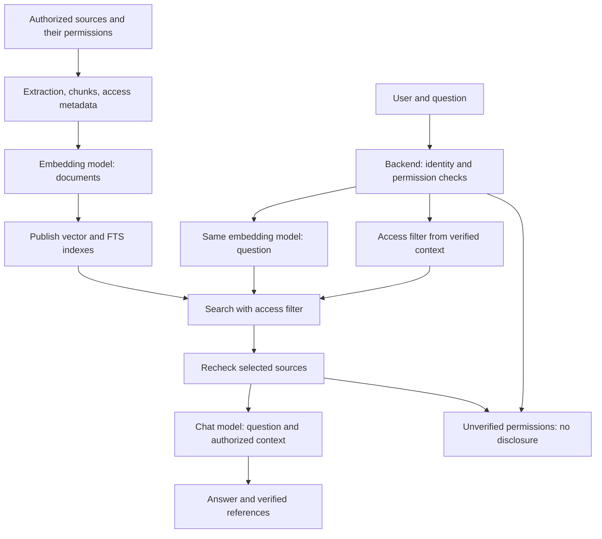

# RAG Support Chat — Specification and Implementation Order

## Status and Scope

This document describes a **planned extension**, not an implemented AutoBI capability.
The target design is recorded in [ADR-019](12-architecture-decisions.md#adr-019--rag-support-chat).
Implementation requires a task covering RAG and a phase with dependencies and exit criteria
in the [roadmap](../roadmap/ROADMAP.md). This document does not change the order or status of existing phases.

Relevant rules: [DDD](04-backend-laravel-ddd.md), [contexts and RBAC](05-bounded-contexts.md),
[API](07-api-and-integration.md), [queues](08-events-outbox-async.md),
[infrastructure](09-infrastructure-deployment-observability.md), [testing](10-testing-and-quality.md).
The paths below follow the repository structure: `backend/`, `frontend/`, `contracts/`, `infra/`.

## What Is RAG?

**RAG (Retrieval-Augmented Generation)** generates answers augmented with retrieved context.
The system restricts search to documents accessible to the user, finds suitable passages,
and sends the authorized text together with the question to a language model. The entire corpus is not placed in the prompt;
the knowledge base is updated by indexing documents, without retraining the answer model.

| Component                  | Purpose                                                                                |
| -------------------------- | -------------------------------------------------------------------------------------- |
| Chunk                      | A document passage with text, provenance, and inherited access permissions             |
| Embedding model            | Converts chunks and the search question into numeric vectors for semantic comparison   |
| Vector store               | Stores embeddings and supports searching for nearby vectors with access restrictions   |
| Retrieval                  | Selects relevant authorized chunks; AutoBI supplements semantic search with FTS        |
| Answer model (`ChatModel`) | Receives the question and retrieved text and produces an answer with source references |

**The same embedding model and a compatible profile are used for chunks and questions.**
The profile specifies the model version, dimensions, normalization, and the model's supported
document/query modes. Matching dimensions alone do not make vectors compatible.
The embedding model participates in search; a separate chat model produces the answer text and
does not have to match it or use the same provider.

Semantic search can find an instruction titled “Configuring Alert Thresholds” for the question
“How do I know when a product is running out?”, even without exact word matches. Vector proximity
helps select a potentially relevant source but does not establish a fact or grant access.

The two flows are separate: knowledge preparation runs in the background, while search runs for a specific user.



**Security is enforced around the LLM:** the backend restricts search and data transfer.
A prompt instruction to “not show secret documents” is not an authorization mechanism.
Documents inaccessible to the user must not enter the model's context, even if the model could
hide them in its answer. This principle also applies to a future reranker or other AI components.

## MVP Goal and Boundaries

The chat helps users understand the BI platform's capabilities, settings, interface,
metric methodology, and common errors using published AutoBI documentation.
The MVP answers from documentation/FAQ; it does not receive actual sales, stock, or other
workspace data, execute SQL, or modify platform resources. When asked about specific business data,
it explains the limitation and points to the relevant report if a source is available.

Stack: Next.js UI, Laravel DDD, PostgreSQL with pgvector and FTS, Laravel Queue, HTTP JSON + SSE.
Do not add Python/FastAPI, a separate vector DB, LangChain, GraphRAG, or an agent runtime.
In the original definition, Qdrant is an example of a vector database with payload filtering. In AutoBI,
pgvector together with PostgreSQL metadata tables fulfills that role; ADR-019 records this choice.
RAG does not require a particular vector database. Changing the store requires a separate justification.

The MVP includes a shared knowledge base, private conversations, streaming, persisted history,
connection recovery, citations, feedback, limits, and quality evaluation.
Private organizational documents, PDF/DOCX, external connectors, reranking, query rewriting,
conversation-aware retrieval, and tool calling are separate extensions.

## Design Questions and Decisions

Record the following answers before connecting each source. The MVP answers are defined below;
for enterprise sources, they are required input to the design of the next phase.

| Question                                       | AutoBI MVP                                                                                                  | Requirement for private sources                                                                      |
| ---------------------------------------------- | ----------------------------------------------------------------------------------------------------------- | ---------------------------------------------------------------------------------------------------- |
| What data is connected, and who can access it? | Explicitly published AutoBI Markdown/FAQ shared by chat users                                               | A source registry, owners, data categories, and each source's access model                           |
| Where is the user identified?                  | Laravel validates the Sanctum Bearer token forwarded by the existing Next.js BFF and the selected workspace | Map verified identity to the source's user and groups; do not trust IDs in the request body          |
| Where are document permissions defined?        | The publication manifest and current document status in `KnowledgeBase`                                     | The source system, such as Confluence, remains the source of truth for document ACLs                 |
| How do permissions enter the index?            | Explicit `scope = global`, `workspace_id = null`, policy version, and publication status                    | A normalized document policy, its version, and a link from every chunk to that policy                |
| Where is the security filter applied?          | In `KnowledgeBase`, in both SQL branches before limiting candidates; rechecked before the LLM               | At the search boundary, before text is passed to `Support`, a reranker, or an LLM                    |
| Is pre-filtering possible?                     | Yes: exact vector search and FTS over authorized documents                                                  | Prefer pre-filtering; complex ACLs may use a separately verified hybrid approach                     |
| What happens if authorization is unavailable?  | Fail closed: stop disclosure with a safe error                                                              | The same rule applies to an external service, unknown permissions, or unreliable ACL synchronization |

## Architectural Boundaries

Two new bounded contexts live inside the existing analytics service:

| Context                | Ownership and responsibility                                                                            |
| ---------------------- | ------------------------------------------------------------------------------------------------------- |
| `Support`              | Conversations, messages, generation attempts, feedback, RAG orchestration, generation limits, and usage |
| `KnowledgeBase`        | Sources, document versions, chunks, embeddings, index publication, and retrieval                        |
| `Workspace` (existing) | Membership, roles, capabilities, and verified access context                                            |

`Support` calls the public retrieval application port in `KnowledgeBase` with a verified access
context, question, and budget. The result is a DTO of authorized passages with provenance, versions,
and scores; direct reads of another context's Eloquent models are prohibited. `KnowledgeBase` does not depend on conversations.
Both contexts use public `Workspace` contracts without duplicating role rules.
`Workspace` confirms chat access; `KnowledgeBase` enforces document read permissions.
An AutoBI role alone does not grant access to material in an external system.
When sources are connected, an external authorization service sits behind a `KnowledgeBase`
application port; the MVP does not require a separate authorization service.

Domain does not depend on Laravel, HTTP, SDKs, or pgvector. Application handles orchestration;
Infrastructure implements persistence, search, queues, and AI providers. Controllers and jobs remain thin.
Next.js handles UI and transport; where needed, the BFF only forwards the session, workspace, and stream.

AI ports: `ChatModel` and `EmbeddingModel`. Add `Reranker` with the corresponding feature.
Provider-specific SDKs, payloads, and exceptions stay in Infrastructure. The MVP uses one
selected chat provider and one embedding profile; there is no automatic provider switching.

## Access and Isolation

### User, Workspace, and Conversation

The tenancy unit is the existing **Workspace**. Use `workspace_id` in persistence/API;
do not introduce a separate tenant entity or parallel `tenant_id`.

- Every conversation has immutable `workspace_id` and `owner_user_id` values from the server-verified session.
- For the planned MVP, add the `support.use` capability to all three existing roles.
  Extend the enum, role mapping, `WorkspaceResponse`, and OpenAPI together during implementation;
  the current capability set is not considered changed until then.
- All chat operations require current membership, `support.use`, and conversation ownership.
  A workspace owner does not gain access to other users' conversations solely through the `owner` role.
- Messages, generations, feedback, and citations are authorized through their conversation. Checking a UUID without scope
  is insufficient; cross-user/cross-workspace requests return `404` without revealing that the resource exists.
- No session means `401`; a missing capability uses the existing `403 INSUFFICIENT_CAPABILITY`.
  Workspace selection follows the current API and `WorkspaceAccessGuard`; an input ID is not proof of trust.
  The browser uses `/api/backend/*`; the BFF forwards the Bearer token from the HttpOnly session
  and `X-Workspace-Id`. The `X-User-Id` header is not proof of identity (ADR-021).
- The backend filters the conversation list by user and workspace. Switching workspaces in the frontend
  closes the stream and clears the displayed conversation before authorized data is loaded.
- The worker rechecks access before retrieval and external calls. SSE checks access
  to the conversation and sources on connection and before sending each update; after access
  is revoked, it stops sending the affected text.
  Data already sent to the provider cannot be recalled.

The shared base contains only explicitly published AutoBI material: `scope = global`,
`workspace_id = null`. Future private documents use `scope = workspace`, a nonempty
`workspace_id`, and a document ACL. A database constraint prohibits inconsistent scope/ID combinations;
an absent workspace does not make a document global by itself.
Only a trusted documentation maintenance process may publish global material.
The MVP has no user-facing knowledge publication API.

### Document ACLs and Search Metadata

An ACL (Access Control List) defines who can read a document. Each chunk inherits
the source document's effective policy, including parent-section restrictions when
present in the source. Search must not broaden access compared with the source system.
A connector service account's ability to read the entire source is not a user's permission.

Access metadata logically includes `scope`, `workspace_id`, `document_id`, publication/revocation,
`access_policy_id`, `acl_version`, and sensitivity class. Private sources additionally include
the document's source identifier, verified access principals, and ACL freshness information.
This is the target model: the MVP stores a shared publication policy; user and group ACLs
are implemented with private sources. An empty or unknown policy denies access.

In PostgreSQL, the policy and user/group-to-document relationships may be stored separately from chunks
and participate in search through `JOIN`/`EXISTS`. There is no need to copy thousands of user IDs into every chunk.
In a store such as Qdrant, the corresponding fields reside in the payload, and the backend supplies a filter
with verified access principals. The payload is a permissions projection, not an independent
source of truth. These filtering capabilities are described in the [Qdrant documentation](https://qdrant.tech/documentation/search/filtering/).

For a simple allowlist, a private document is accessible if the workspace matches
and the user or a verified group is included in the ACL. Explicit denies, inheritance,
and exceptions are resolved according to the source system's rules before constructing the effective policy.
Do not replace a complex ACL with a simple group check that loses restrictions.

### Pre-filtering, Post-filtering, and Complex ACLs

| Approach                   | Order of operations                                                                                     | AutoBI decision                                                                |
| -------------------------- | ------------------------------------------------------------------------------------------------------- | ------------------------------------------------------------------------------ |
| Pre-filtering              | Restrict the accessible set, then select the most relevant chunks                                       | The baseline for vector search and FTS                                         |
| Post-filtering             | Retrieve an overall top-k, then remove inaccessible candidates                                          | Do not use as the only mechanism: authorized sources may never enter the top-k |
| Hybrid access verification | First restrict the search scope, then verify the remaining complex ACLs against an authoritative source | Only for future sources where full pre-filtering is impossible                 |

Post-filtering can waste search on inaccessible documents and leave no results even when
an accessible answer exists. Rechecking already authorized candidates before the LLM is useful
for detecting revoked permissions; it does not replace the main filter.

Complex individual ACLs may use sets of authorized document IDs, SQL relationships, or
bitmaps behind an infrastructure adapter. The choice depends on ACL size,
change frequency, and measurements; no separate mechanism is introduced in the MVP.
A hybrid approach requires a workspace filter, bounded candidate scanning,
and verification of every document before its text crosses the retrieval boundary. Until permissions are confirmed,
candidates remain internal IDs/scores; titles, snippets, and URLs are not disclosed either.
Hybrid access verification does not mean hybrid retrieval: combining vector search and FTS
addresses relevance, not authorization.

### Fail Closed: Unverified Permissions Mean No Disclosure

Access verification distinguishes `allowed`, `denied`, and `unavailable`. A timeout, service failure,
incomplete ACLs, or inability to confirm their freshness must not become `allowed`.
If a required check is unavailable, stop the entire request: do not remove the filter,
continue against the shared corpus, or ask the LLM to decide what may be disclosed.

```text
User → Backend → Permission check
                       ↓ timeout / unknown policy
          Backend → 503 AUTHORIZATION_UNAVAILABLE
                       ↓
             Source text is not sent to the LLM
```

Before SSE starts, return `503 AUTHORIZATION_UNAVAILABLE` with the message
“Access to the information could not be safely verified. Please try again later.”
A confirmed capability denial remains `403`; another user's resource returns `404`.
A document with a confirmed denial is excluded from results without revealing its existence;
uncertainty about permissions is an error, not a `no_context` result.

If the error occurs in a worker, the generation ends as `failed`, not as a successful answer.
After SSE opens, only a safe `failed` event may be sent, provided access to the conversation
itself is verified; otherwise close the connection without data. Polling, reconnect, history, and citations
follow the same checks. Stop further disclosure when permissions are revoked; data already sent
to an external provider or user cannot be taken back.

### Permission Caching and TTL

The access-decision cache is separate from answer, retrieval, and embedding caches. In the MVP, membership,
ownership, and publication checks use current data without a cross-request permission cache.
If caching is introduced later, TTL is determined by the data class and acceptable revocation delay:

| Category                        | TTL policy                                                                                                     |
| ------------------------------- | -------------------------------------------------------------------------------------------------------------- |
| Explicitly public documentation | Up to 24 hours for the public-status decision; current publication and revocation are checked separately       |
| Restricted internal documents   | 0 by default; a positive TTL is allowed only after agreeing on the revocation delay and invalidation mechanism |
| Secret or critical documents    | 0 minutes: check the authoritative source on every request                                                     |

24 hours and 0 minutes are example policy boundaries, not universal settings for every source.
A document's public status does not remove the need to check access to a private conversation and workspace.
The decision key includes the user, workspace, source/document, `read` action, and membership/group
and ACL versions. Permission changes, deletion, or changes in sensitivity class invalidate the old
permission; TTL does not replace invalidation. For an external source, define the change-detection
method and maximum delay in advance: a local TTL alone does not ensure immediate revocation
in Confluence or another system.

Expired permissions, unknown policy versions, and authorization errors do not permit
stale-while-revalidate or stale-if-error. If a required permission source is known to be unavailable,
a cached `allow` is not used. A Redis failure permits a direct check
against the source of truth; if that is unavailable too, fail closed. The analytics cache fallback
semantics from ADR-020 do not permit bypassing RAG authorization.

## Sources and Knowledge Model

The MVP source is an explicit manifest of authorized Markdown/FAQ, versioned in Git.
Do not automatically index the entire repository: architectural plans, source code, secrets,
logs, and internal instructions are not the user knowledge base.
Every item must have a title, language, stable identifier, and a user-accessible URL.
Prepare and review this corpus before the first indexing run; the existence of `docs/architecture/` is not a substitute.

Minimum data:

| Object            | Required information                                                                                                      |
| ----------------- | ------------------------------------------------------------------------------------------------------------------------- |
| Source            | ID, type, manifest revision, authorized path/URL, scope, workspace, source of access rules                                |
| Document version  | Document ID, revision/content hash, title, language, canonical URL, status, reference to access policy                    |
| Access policy     | Policy ID, ACL version, scope/workspace, sensitivity class, current access status; a shared publication policy in the MVP |
| Chunk             | ID, document version, chunk index, heading/anchor, content/hash, scope/workspace, policy ID/version, FTS configuration    |
| Embedding profile | Provider/model/version, dimensions, distance metric, normalization, document/query modes, and chunking version            |
| Index build       | ID, manifest revision, embedding profile, status, active publication pointer                                              |

Embeddings and `search_vector` belong to a specific build. Chunk uniqueness is defined by
build, document version, and chunk index. `content_hash` does not replace an idempotency key.
The column dimensions and distance operator must match the profile. Vectors from different models
must not be mixed, even with equal dimensions; queries use the active index's profile.
The ACL version is independent of the embedding build lifecycle: permission changes must not wait
for embeddings to be recomputed. Retrieval compares the projection with the current policy;
on a version mismatch, the document is inaccessible until metadata is safely updated.

For the MVP, the corpus and evaluation language is Russian with English technical terms.
Use the same explicitly specified PostgreSQL FTS configuration for indexing and querying
(`russian` for Russian material, `english` for explicitly English material). Test FAQ entries with abbreviations
and UI element names; adding languages requires a separate quality evaluation set.

## Ingestion and Index Publication

Asynchronous pipeline: `Manifest + Access policy → Extract → Normalize → Chunk → Embed → Validate → Publish`.

1. Record the manifest revision and verified access policy, and create a build with `pending` status.
   If permissions are undefined, the source is neither indexed nor sent to the embedding provider.
2. The worker moves it to `indexing` and splits Markdown by headings and semantic blocks.
   The initial target is up to 500 tokens per chunk with overlap up to 75; exact parameters and tokenizer
   are recorded in the profile and tested against the corpus. All chunks retain their link to the document policy.
3. Persist results using an idempotent upsert. Repeating a job does not create duplicates;
   do not request completed embeddings again. The job key includes the build/document revision.
4. Check completeness, dimensions, provenance, policy freshness, and absence of prohibited material.
5. Only a fully complete build becomes `ready`; a short transaction atomically switches
   the active pointer. Use compare-and-swap against the expected publication so that
   a slow old build cannot overwrite a newer version.

Errors move the build to `failed`; the previous active index remains available.
This applies to content-building errors: a revoked or unverified policy blocks access
to the affected source in the previous build as well. A permission synchronization error does not preserve access
through the old index. Republishing must not restore revoked permissions.
Transient embedding errors allow no more than three attempts with backoff/jitter and respect for
`Retry-After`; do not automatically retry format/dimension errors.
A new embedding profile requires a complete separate build and quality evaluation before switching.

Revoking/deleting a document immediately excludes it from retrieval and citation output regardless
of reindexing status. Publication and access checks are also mandatory before sending
selected passages to the provider. A new corpus version must not contain deleted material.
Old builds are cleaned up after generations using them finish; history stores provenance
and a safe citation snapshot but does not grant renewed access to revoked source text.

## Retrieval and No-Answer Behavior

For the MVP, use exact vector search as the baseline and PostgreSQL FTS with a GIN index.
SQL predicates define the authorized set before top-k selection in each search branch.
Add HNSW/IVFFlat only after measurement: with pgvector approximate indexes, filtering happens
after scanning the ANN index, so a `WHERE` clause does not imply physical pre-filtering
of index traversal. Separately verify recall and the iterative-scan/alternative-access strategy;
do not relax ACLs to fill the top-k. See [pgvector Filtering](https://github.com/pgvector/pgvector#filtering).
SQL performs filtering and ranking; the entire corpus is not loaded into PHP.

Algorithm:

1. Check access, question validation, and limits; pin the active build, retrieval profile,
   and verified authorization context. A permission-check failure stops the pipeline before provider calls.
2. Obtain the question embedding using this build's model.
3. In each search branch, apply publication/deletion, scope/workspace, and ACL predicates
   **inside SQL before `LIMIT`**. The MVP permits only published global material;
   a future private branch adds only documents authorized for the workspace and user.
4. Retrieve up to 30 vector-search candidates and up to 30 FTS candidates; retain the original scores and ranks.
5. Combine ranks using Reciprocal Rank Fusion: `sum(1 / (60 + rank))`, with rank starting at 1.
   Deduplicate by chunk ID and break ties by stable ID. Do not directly add
   cosine distance and `ts_rank`: their meaning and scale differ.
6. Select up to 6 chunks within the context budget. Apply a calibrated evidence-sufficiency
   rule whose version and parameters are recorded in the evaluation report.
   An RRF score is not a probability of correctness.
7. Recheck source availability and policy versions. Exclude revoked chunks
   and reassess the remaining evidence; fail the attempt if permissions are uncertain.
   Send only the authorized context and current question to the LLM.

For empty results or insufficient evidence, return a persisted `no_context` answer
asking the user to clarify; do not call the chat model. A database/embedding-provider failure is
a technical error, not proof that no answer exists; do not disguise it as `no_context`.
If the model cannot answer from the retrieved context, the same explicit refusal is allowed.

In the MVP, retrieval and generation use the current question, without previous messages as evidence.
History is available for viewing. For follow-ups that are not self-contained, such as “Where is that?”, the chat asks
the user to rephrase; the UI briefly explains this limitation. Sending and condensing history
are introduced together with conversation-aware retrieval and dedicated tests.

## API and Generation Lifecycle

Before backend implementation, extend `contracts/openapi/analytics-v2.yaml`: JSON DTOs, security,
`x-required-capability`, pagination, errors, `text/event-stream`, and event schemas with examples.
Define the distinction between `403`/`404`, `503 AUTHORIZATION_UNAVAILABLE`, and `completed/no_context`;
an authorization error returns neither source text nor a partial answer. A transient failure allows
an explicit retry once permission checks recover, with fresh access and budget checks.
Order: contract → compatibility check → backend → frontend client generation → contract tests.
The SSE parser may be a separate transport helper; payload types come from the contract.

All paths use the `/api/v2/support` prefix and existing Bearer authorization through the BFF (ADR-021):

| Method and path                     | Behavior                                                                     |
| ----------------------------------- | ---------------------------------------------------------------------------- |
| `POST /conversations`               | `201`, create a private conversation in the verified workspace               |
| `GET /conversations`                | Cursor pagination of the user's own conversations only                       |
| `GET /conversations/{id}`           | Metadata for an authorized conversation                                      |
| `DELETE /conversations/{id}`        | `204`, block access and schedule data cleanup                                |
| `POST /conversations/{id}/messages` | Accept text and `client_message_id`, return `202` and message/generation IDs |
| `GET /conversations/{id}/messages`  | Cursor pagination, persisted content/status, citations, and generation IDs   |
| `GET /generations/{id}`             | Persisted generation state and current text                                  |
| `GET /generations/{id}/events`      | Observe an existing generation over SSE; does not start the model            |
| `POST /generations/{id}/retry`      | An explicit new attempt for `failed` only, `202`, a new generation ID        |
| `POST /messages/{id}/feedback`      | Upsert a `helpful`/`not_helpful` rating for the user's own completed answer  |

Messages have a stable order within a conversation. The default page size is 20,
with a maximum of 100. Feedback is unique per message/user; resubmitting updates the rating.

`Idempotency-Key` is required for conversation creation, message sending, and retry. The key scope is:
user + workspace + operation + resource. Store the payload hash and result for at least 24 hours:
the same request returns the existing IDs without a new job; a different payload with the same key returns `409`.
Additional uniqueness of `(conversation_id, client_message_id)` lasts for the conversation's lifetime.
Retry has its own request ID, retained for the original message's lifetime.
For both long-lived IDs, retain the original payload hash and result association: after
24 hours, a repeat still returns the existing IDs, while a mismatched payload returns `409`.
Check access before returning a deduplicated result. Deduplication precedes
admission, budget reservation, and the busy-conversation check: repeating an accepted request
does not consume the new-run limit or create a new reservation.

In one transaction, persist the user message, answer placeholder, `queued` generation,
and limit reservation; serialize concurrent requests on the conversation. Only one unfinished
generation per conversation is allowed; otherwise return `409 GENERATION_IN_PROGRESS`.
Start the worker after commit. To handle failure between commit and enqueue, use a periodic
dispatcher for persisted `queued` records; an idempotent claim by generation ID prevents
concurrent model calls. PostgreSQL is the source of truth; the queue delivers only the ID.

States: `queued → running → completed | failed`; `queued → failed` when the queue wait expires.
A completed `no_context` is `completed` with outcome `no_context`; a normal answer has outcome `answered`.
Terminal attempts are immutable; retry creates a new attempt and a new answer placeholder for the same
user message. The previous attempt is retained. Retry is allowed only for the conversation's latest
user message and only for its most recent generation in `failed` state,
before the next turn begins. Check this under the same conversation lock: a stale failed attempt
after a successful or started retry returns `409 RETRY_SUPERSEDED` instead of starting the model.
Repeating an already accepted request ID first undergoes deduplication and returns the existing result.

The worker has a lease/heartbeat and a bounded deadline. An expired `running` attempt moves to `failed`
with `GENERATION_INTERRUPTED`; automatically retrying a paid chat call is prohibited.
Late worker writes are rejected using the claim token and state. An external call does not hold a database transaction.
Exactly-once external provider invocation is not promised: network uncertainty may leave
usage unknown; the user can deliberately start a new attempt.

## SSE and Recovery

The worker persists accumulated text in small batches, incrementing `sequence` atomically
with the snapshot/status. SSE exposes only persisted state and does not own generation.
The initial update target is no more than once every 250 ms; measure PostgreSQL load.

| Event       | Payload and semantics                                                                |
| ----------- | ------------------------------------------------------------------------------------ |
| `snapshot`  | IDs, sequence, status, full accumulated text; the client replaces its current buffer |
| `completed` | IDs, sequence, final text, outcome, verified citations; the client closes the stream |
| `failed`    | IDs, sequence, safe error code, retryable; partial text is not considered an answer  |

SSE `id` corresponds to the sequence within a generation. On connection, the server first reads
the current state; for a terminal attempt, it immediately sends the terminal event.
On reconnect, it sends a fresh full snapshot, then only new states.
`Last-Event-ID` is a hint, not a promise to replay every token. The client does not concatenate snapshots,
ignores stale sequences, and does not repeat POST when recovering transport.

Send a heartbeat comment every 15 seconds; if SSE remains unavailable, the UI may read
`GET /generations/{id}` with backoff. Disconnecting or closing the tab does not cancel the worker.
Errors before the stream starts return ordinary HTTP JSON; after opening, they use an event or close
the connection if authorization is lost. Authorization is checked for heartbeat/polling too.

Use the existing session and workspace mechanism. A `fetch`-based SSE reader can provide
the required headers; do not put tokens in URLs or introduce a separate auth strategy.
Across Laravel → proxy/BFF → browser, verify the absence of buffering, `text/event-stream`,
`Cache-Control: no-store`, and aligned timeouts. Persist the terminal state and final text
in the database **before** the `completed` event.

## Citations, Security, and Data

Context and user text are untrusted data. System instructions are separate
from evidence; retrieved instructions cannot change access rules or authorize tools.
The prompt defines the support scope, the requirement to rely on sources, and permission to decline an answer.
The prompt alone is insufficient: access, budgets, and citation validation are enforced in code.

The model references only the local source IDs supplied to it. The backend resolves them to
`document_id`, `revision`, `chunk_id`, `title`, `url`, and `anchor`, and verifies membership
in the context actually supplied. Arbitrary model-generated URLs do not become citations.
An `answered` response requires at least one verified source; invalid references or absent
sources move the attempt to `failed` with `INVALID_CITATIONS`. This is structural validation;
whether the sources substantiate the claims is assessed separately during evaluation.

Streamed text is provisional until `completed`; on failure, the UI marks the attempt incomplete.
Source availability is rechecked when history is read. For a revoked source,
show “Source unavailable” without disclosing its title, content, or private URL.
An answer may contain source information even without a citation: if permission to read any
chunk supplied to the model is revoked, hide the entire persisted answer and its snapshots in subsequent
history, polling, and SSE output. Use the provenance of all context chunks, not just
references selected by the model. Show a safe answer-unavailable message instead of the text.
This disclosure rule does not change the generation's terminal status. If the check itself is unavailable,
return a fail-closed error; a previously saved answer does not permit bypassing the check.

- Render Markdown without raw HTML, unsafe URL schemes, or automatic loading of external images.
  The server constructs citation URLs from authorized sources, not from model text.
- The chat provider receives the current question and authorized chunks; the embedding provider receives the question
  and text authorized for indexing. Do not send session tokens, internal user IDs,
  conversation history, or actual BI data. The user's question may itself contain personal data.
- Before enabling an external provider, record the model, processing region/mode, retention/training
  settings, and permitted data categories; display a brief notice about external processing.
  Do not automatically switch to a provider with a different data policy.
- AI keys are available only to the backend/worker. Logs contain IDs, codes, and metrics;
  they must not contain raw prompts, documents, credentials, or full provider exceptions.
- Initial retention for conversations and generation metadata is 90 days after the last activity.
  Deleting a conversation/user/workspace immediately blocks reads and new calls;
  messages, partial answers, feedback, and idempotency data are cleaned up within 24 hours.
  An active worker stops further writes on deletion; document backup retention
  before production. Aggregated anonymized metrics may be stored separately.
- Do not introduce a shared answer/retrieval cache in the MVP. A future cache must account for workspace,
  user/ACL, corpus/profile version, and access revocation. A cache hit does not remove the need to
  reauthorize sources; answer TTL does not define access-decision TTL.

## Limits and Observability

Initial values are configurable MVP limits, not performance promises:

| Limit                   | Value                                                                                    |
| ----------------------- | ---------------------------------------------------------------------------------------- |
| Question                | Up to 4,000 characters and 2,000 tokens; both limits apply                               |
| Evidence                | Up to 6 chunks and 4,000 tokens                                                          |
| Answer                  | Up to 1,000 tokens; an incomplete answer that reaches the limit is not marked successful |
| Runs, including retries | 10 per minute per user, 60 per workspace                                                 |
| Active queued/running   | 1 per conversation, 2 per user, 5 per workspace                                          |
| Deadline                | 30 seconds waiting in the queue, 90 seconds executing a generation                       |

Check the full prompt, including instructions and reserved answer capacity, against the model's context window.
Before the first provider call, configure a finite daily token/cost budget per workspace
and an overall environment budget. Check/reserve budgets atomically; reconcile them with
actual usage on completion. Do not automatically release a reservation if usage is unknown after failure.
Embedding ingestion has a separate budget and queue so it does not block generations or the outbox.
Exceeding a limit returns `429` with a stable code and `Retry-After`; admission rejection does not create a generation.

Record generation ID, conversation/message IDs, workspace/user, attempt, status/outcome,
provider/model/profile and prompt version, corpus build, retrieved and selected chunk IDs,
scores/ranks, retrieval parameters, citations, token usage, known/estimated cost,
queue/retrieval/first-output/total latency, correlation ID, and a safe error code.
For access verification, record the result and policy version, check duration, and the reason
for failing closed; do not put group membership, full ACLs, or restricted source text in ordinary logs.
Mark unknown usage explicitly rather than recording it as zero.
Feedback is associated with a specific answer/attempt.

Metrics: errors by stage, no-context rate, queue and stuck attempts, p50/p95 latency,
cost and budget rejections, authorization failures, and policy update lag.
When introducing a permission cache, add hit/miss and invalidation metrics without high-cardinality user/document ID labels.
A provider failure must not stop core BI endpoints.
Generation and indexing queues are served separately from priority outbox tasks;
do not add an AI provider to the analytics service's mandatory overall readiness dependencies.

## Checks and Readiness Criteria

### Required Automated Checks

- Domain/Application: ownership, states, concurrent send/retry, limits, no-context without a chat call,
  lease expiry, and rejection of late writes. Regular CI replaces providers with deterministic fakes.
- Access: missing or unknown policy version, authorization failure/timeout before retrieval,
  before the LLM, and during disclosure. Verify that prohibited text is absent from provider payloads,
  snapshots, history, and citations; a failure must not become `no_context` or remove filters.
- PostgreSQL integration with pgvector: real migrations, FTS/vector filtering before result limits,
  repeated ingestion jobs, partial failure, atomic publication, an old build completing after a new one, profile changes,
  and immediate exclusion of revoked documents. Verify that deliberately closer prohibited
  chunks do not displace an authorized answer from the top-k, and that FTS does not bypass vector-branch restrictions.
  Incompatible embeddings are prohibited even with equal dimensions. SQLite cannot replace these checks.
- API/contract: DTOs, capabilities, pagination, SSE events, repeated idempotency keys and payload conflicts,
  inaccessibility of other users' conversations/messages/generations/citations/feedback, membership revocation, and deletion.
- E2E: question → stream → citations → history reload; disconnect/reconnect without a second call,
  failure → explicit retry, workspace switching, no-context, safe Markdown, feedback, and limits;
  source revocation hides derived answers, including completed and partially persisted ones.
- Infrastructure: buffering/timeouts through the actual proxy/BFF, queue unavailability after commit,
  dispatcher recovery, worker crashes, bounded SSE load, and absence of text/secrets in logs.
- Architecture: Domain without frameworks/SDKs; cross-context dependencies only through public contracts.

### Evaluation Before MVP Release

Before tuning thresholds, prepare a versioned corpus and split examples into calibration and holdout sets.
The holdout contains at least 60 questions: 40 answerable with labeled sources, 10 unanswerable,
and 10 adversarial/out-of-scope; include Russian phrasing, abbreviations, and ambiguous follow-ups.
Do not tune retrieval thresholds on the holdout. Retain the dataset revision, parameters, model,
prompt version, and results; LLM-as-judge scores do not replace human review of disputed answers.

Initial holdout release gates:

- The top-6 context contains at least one labeled sufficient source for ≥ 90% of answerable questions.
- ≥ 90% of answerable questions receive a correct answer supported by citations; refusing such
  a question counts as failure, so persistent `no_context` cannot pass the quality check.
- ≥ 90% of unanswerable questions receive an explicit refusal/clarification request without invented facts.
- 100% of checked citations belong to authorized context actually supplied to the model.
- All adversarial checks preserve access boundaries/support scope; leaks and unsafe HTML: 0.

A real-provider run is a separate controlled check with a limited budget.
Record cost and p50/p95 time to first text and completion in the report. A small holdout
does not prove the absence of hallucinations for every possible question; add new failures to the regression set.
Repeat evaluation after changing the chat/embedding model, prompt, chunking, or retrieval profile.

### MVP Exit Criteria

- The full E2E flow works with persistence and state recovery; the contract and generated client agree.
- Conversations are isolated by user/workspace even with a shared knowledge base; the backend checks new capabilities.
- The corpus is published reproducibly; partial builds and deleted documents do not enter context.
- Chunk and question embeddings belong to the same profile; filters in both branches and rechecking
  before the LLM are mandatory. Authorization failure blocks disclosure; revocation blocks
  sources and derived answers regardless of reindexing or persisted history.
- Citations, no-context, failure/retry, limits, retention, and observability are implemented and verified.
- Automated checks and evaluation gates pass; results, cost, and operational limitations are recorded.
- CI, migrations, and the phase integration checkpoint are confirmed. Updating this document does not close the phase.

## Implementation Order

1. Add a RAG phase to the roadmap with dependencies, scope, and checkpoint; prepare an authorized corpus,
   source/access matrix, calibration/holdout sets, and provider configuration with budgets.
2. Finalize OpenAPI v2, SSE schemas, capability extensions, and the public retrieval contract
   with verified access context and a separate authorization-unavailable error.
3. Implement `Support`/`KnowledgeBase` Domain/Application with fakes, fail-closed behavior, and isolation/state tests.
4. Prepare pgvector in dev/test/deploy, schema/migrations, persistence, and profile versioning.
5. Implement ingestion with permission metadata, publication, and hybrid retrieval with pre-filtering;
   verify revocation without reindexing and measure the baseline on the calibration set.
6. Implement orchestration, generation workers/dispatcher, persistence, budgets, and tracing.
7. Implement API/SSE, generate the frontend client, and add UI using the existing UI stack,
   citations, and feedback. Loading/empty/streaming/completed/failed/reconnecting states are distinguishable;
   status is available to screen readers without announcing every token, and keyboard submission is supported.
8. Pass integration/E2E, holdout evaluation, and the checkpoint; record remaining limitations.

## Subsequent Extensions

A private workspace knowledge base is a separate phase after the MVP. Before enabling it, define source-management
permissions and document ACLs, file formats/limits and safe extraction, and whether private data may be sent
to the provider. Apply this document's ACL inheritance, pre-filtering, fail-closed, and derived-answer
hiding rules. For Confluence and other connectors, define identity/group mapping,
inheritance and deny semantics, ACL versions, synchronization and acceptable revocation delay,
authorization timeout, and TTL by data class. Connecting an external system does not broaden
the user's permissions to those of the connector service account.

Private-phase exit criteria additionally require no cross-workspace/cross-user leaks
in vector/FTS retrieval, history, citations, cache, or ACL changes, and reproducible deletion.
Test group and individual grants/denials, group removal, inheritance,
sensitivity-class changes, synchronization delays/failures, stale payloads, cache invalidation,
TTL 0, and positive TTL expiry. When authorization is unavailable, even a warm cache
must not permit disclosure. For a hybrid approach, separately measure recall of authorized
documents and verify that unchecked text never leaves retrieval.

Evaluation expands to “question + user with specific permissions” pairs: the same question
must produce different sets of permitted sources for different users. Permissions and revocation
are tested deterministically; LLM-as-judge evaluation does not replace access checks.
These additional scenarios are not a completion condition for the MVP with a global corpus.

Introduce reranking, query rewriting, and conversation-aware retrieval based on measured baseline failures.
Tool calling requires a separate authorization and side-effect decision; do not enable it
implicitly when connecting a chat provider.

## Technical Sources

- [pgvector: filtering and hybrid search](https://github.com/pgvector/pgvector#filtering) — ANN filtering behavior; the Hybrid Search section describes combining search with FTS/RRF.
- [Qdrant: payload filtering](https://qdrant.tech/documentation/search/filtering/) — the metadata-filtering example from the original definition; not AutoBI's chosen store.
- [WHATWG: Server-sent events](https://html.spec.whatwg.org/multipage/server-sent-events.html) — framing, event IDs, and reconnect; the snapshot protocol above is AutoBI's contract.
- [OWASP: RAG Security](https://cheatsheetseries.owasp.org/cheatsheets/RAG_Security_Cheat_Sheet.html) — trust boundaries, ACLs, provenance, and output security.

Verify framework/SDK/pgvector versions and current APIs through Context7
or official documentation before implementation; this document specifies behavior, not a particular SDK's API.
