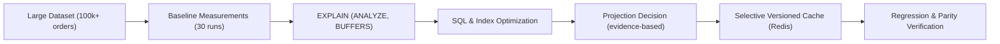
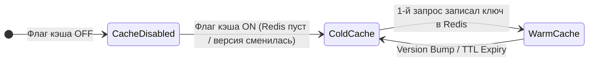

# Performance & Caching Contract — Phase 16

## Введение и назначение

Данный раздел фиксирует инженерный контракт производительности, протокол нагрузочного тестирования, семантику кэширования и бюджеты времени отклика для аналитических сервисов `lecar-bi` в рамках Phase 16 («Performance and Caching»).

Главный инженерный принцип Phase 16:
> **Измерения раньше оптимизаций (evidence-driven engineering).**
> Никакой индекс, SQL-переработка, кэш-слой или материализованное представление не добавляются без воспроизводимого замера baseline, анализа планов `EXPLAIN (ANALYZE, BUFFERS)` и подтверждения проблемы на эталонном наборе данных.



---

## Архитектурные принципы и границы

1. **PostgreSQL — единственный источник истины:**
   - Redis используется исключительно как селективный, инвалидируемый кэш результатов чтения.
   - Подмена первичных данных в PostgreSQL данными из Redis категорически запрещена.
   - Никаких внешних хранилищ (Elasticsearch, ClickHouse) без доказанной невозможности решения в PostgreSQL.
2. **Тяжёлая обработка остаётся в СУБД:**
   - PHP runtime не загружает полный аналитический датасет в память ради сортировки, пагинации или группировки.
   - Пагинация и фильтрация выполняются на уровне SQL-запросов с использованием соответствующих индексов.
3. **Селективное кэширование на границе Read Model:**
   - Кэшируются только детерминированные, повторяемые низкокардинальные агрегаты и варианты фильтров (allowlist).
   - Поисковые запросы, пагинированные списки записей и команды не кэшируются по умолчанию.
   - Кэш применяется строго внутри инфраструктурных декораторов Read Model после прохождения границ аутентификации, авторизации (RBAC) и валидации workspace.
4. **Отказоустойчивость (Fail-Open):**
   - Недоступность или деградация Redis приводит исключительно к увеличению задержки (latency fallback на прямой запрос к PostgreSQL), но не к ошибке для пользователя (HTTP 500).
5. **Изоляция рабочих пространств (Multi-tenancy):**
   - Кэш изолирован по `workspace_id`. Пересечение данных или очистка чужих пространств технически исключены.

---

## Эталонное окружение (Reference Environment)

Все официальные замеры latency и планов выполнения проводятся в изолированном эталонном Docker-окружении на Linux.

| Компонент | Версия / Конфигурация | Назначение / Ограничения |
|---|---|---|
| **Хост ОС** | Linux (Ubuntu 22.04+ / Debian 12 / Arch), kernel 6.x | Эталонная среда исполнения |
| **CPU / RAM Allocation** | 4 vCPU, 8 GB RAM выделено под Docker | Исключение троттлинга ресурсов |
| **PHP Runtime** | PHP 8.3 CLI / FPM (OPcache enabled, JIT tracing) | `memory_limit = 512M`, `max_execution_time = 60` |
| **PostgreSQL** | PostgreSQL 16 Alpine | `shared_buffers = 256MB`, `work_mem = 16MB`, `random_page_cost = 1.1` |
| **Redis** | Redis 7.2 Alpine | Отдельная база для кэша (db 1), `maxmemory = 512mb`, `maxmemory-policy = volatile-ttl` |
| **Сеть** | Docker bridge network | Локальное межконтейнерное взаимодействие без внешнего сетевого оверхеда |

---

## Профиль данных `large` (Reference Dataset Profile)

Для выявления узких мест в масштабировании используется детерминированный профиль данных `large`.

### Параметры генерации

- **Целевое рабочее пространство:** `perf-ws-1` (строго изолировано, не затрагивает рабочие данные `ws-1` и `ws-2`).
- **Seed псевдослучайного генератора:** `42` (детерминированное распределение дат, сумм, статусов и сущностей).
- **Механика формирования:** Потоковая генерация через генераторы PHP (`yield`) и пакетная вставка (chunked inserts по 500–1000 строк) внутри транзакций без накопления массива объектов в памяти процесса.

### Объёмы сущностей в профиле `large`

| Сущность / Таблица | Целевое количество строк | Описание и кардинальность |
|---|---:|---|
| **Orders** (`sales_orders`) | **100 000** | Заказы за 12 месяцев, распределение по статусам и регионам |
| **Order Items** (`sales_order_items`) | **300 000** | В среднем ~3 позиции на заказ, привязка к товарам и категориям |
| **Inventory Snapshots** (`inventory_snapshots`) | **500 000** | Снимки остатков по складам и товарам с историей изменений |
| **Supplier Deliveries** (`supplier_deliveries`) | **200 000** | Поставки от поставщиков со статусами исполнения и датами план/факт |
| **Products** (`products`) | **10 000** | Справочник товаров с распределением по 10 категориям |
| **Categories** (`categories`) | **10** | Товарные категории (cardinality = 10) |
| **Warehouses** (`warehouses`) | **5** | Склады хранения (cardinality = 5) |
| **Suppliers** (`suppliers`) | **50** | Поставщики (cardinality = 50) |
| **Regions** (`regions`) | **8** | Географические регионы сбыта (cardinality = 8) |
| **Customers** (`customers`) | **5 000** | Клиенты b2b / розница |

### Профиль `small` (для быстрых интеграционных тестов)
Для быстрого прогона в рамках feature-тестов генератора и команд используется профиль `small` (1 000 заказов, 3 000 позиций, 5 000 остатков, 2 000 поставок, 100 товаров).

### Проверка объёмов строк (Row Counts Verification)
Перед проведением замеров фактическое состояние БД валидируется SQL-запросом:
```sql
SELECT 
    'sales_orders' AS table_name, COUNT(*) AS row_count FROM sales_orders WHERE workspace_id = 'perf-ws-1'
UNION ALL
SELECT 'sales_order_items', COUNT(*) FROM sales_order_items WHERE order_id IN (SELECT id FROM sales_orders WHERE workspace_id = 'perf-ws-1')
UNION ALL
SELECT 'inventory_snapshots', COUNT(*) FROM inventory_snapshots WHERE workspace_id = 'perf-ws-1'
UNION ALL
SELECT 'supplier_deliveries', COUNT(*) FROM supplier_deliveries WHERE workspace_id = 'perf-ws-1'
UNION ALL
SELECT 'products', COUNT(*) FROM products WHERE workspace_id = 'perf-ws-1';
```

---

## Протокол бенчмаркинга и замера метрик

### Цикл прогона сценария

Для каждого бенчмарк-сценария из [матрицы сценариев](phase-16-baseline.md) выполняется строго следующий протокол:
1. **5 warm-up итераций:** Разогрев PHP OPcache, установление соединений с БД, наполнение shared buffers PostgreSQL. Данные этих итераций не включаются в расчёт перцентилей.
2. **30 измеряемых итераций:** Сбор времени выполнения, таймингов БД и системных ресурсов.
3. **Расчёт метрик:** Вычисление `p50` (медиана), `p95` (95-й перцентиль), `min`, `max`, `avg`, `query_count`.

### Состояния кэша при замерах

Документация и раннер строго разделяют состояния кэша:



1. **`disabled` (Cache Disabled):**
   - Кэширование на уровне Read Model отключено конфигурацией (`ANALYTICS_CACHE_ENABLED=false`).
   - Каждый запрос выполняется напрямую в PostgreSQL через исходную Read Model.
   - Фиксирует реальную производительность SQL и индексов при прогретых shared buffers PostgreSQL.
2. **`cold` (Cold Cache):**
   - Кэширование включено, но целевой ключ в Redis отсутствует (первый запрос после очистки, запуска или изменения `dataset_version`).
   - Буферы PostgreSQL прогреты (warm-up выполнен).
   - Запрос выполняет вычисление в PostgreSQL, сериализует результат и атомарно сохраняет его в Redis.
3. **`warm` (Warm Cache):**
   - Кэширование включено, ключ уже присутствует в Redis.
   - PostgreSQL не получает ни одного аналитического запроса (Query Count = 0).
   - Ответ десериализуется из памяти Redis и возвращается вызывающему коду.

> [!IMPORTANT]
> **Различие PostgreSQL warm-up и Redis warm cache:**
> - **PostgreSQL warm-up (DB-warm):** Нагрев буферов `shared_buffers` и дискового кэша ОС в PostgreSQL. Предотвращает искажение статистики за счёт первого холодного чтения с SSD/HDD.
> - **Redis warm cache (Cache-warm):** Наличие готового сериализованного DTO в памяти Redis под актуальным ключом версии датасета.

---

## Бюджеты производительности (Performance Budgets)

Зафиксированы следующие жесткие бюджеты для эталонного Docker-профиля на датасете `large`:

| Класс сценария | Бюджет p95 | Дополнительное обязательное условие |
|---|---:|---|
| **Overview / Summary / Filter query без Redis** | **≤ 1 000 ms** | Без загрузки полного датасета в память PHP. Вычисления агрегатов строго в PostgreSQL. |
| **Paginated list и ABC/XYZ query без Redis** | **≤ 1 500 ms** | Пагинация и сортировка на уровне SQL либо измеренно обоснованная проекция. |
| **Warm cached aggregate (Redis)** | **≤ 200 ms** | Семантическая эквивалентность payload'а ответу без кэша (Parity 100%). |
| **Dashboard fan-out из типового набора виджетов** | **≤ 2 000 ms** | Одинаковые агрегаты не создают повторную дублирующую тяжелую нагрузку. |

### Критерии приемки оптимизаций (Improvement Gates)
Для каждого сценария, не укладывающегося в бюджет или признанного узким местом (bottleneck):
1. Требуется достижение бюджета либо **улучшение p95 не менее чем на 30%** относительно baseline.
2. Снижение объёма просмотренных строк (`rows examined`) и дисковых/буферных чтений (`shared_read_blocks`).
3. Ни один соседний сценарий не должен регрессировать более чем на **10%** без документально зафиксированного обоснования.

---

## Запрет wall-clock assertions в обычном CI

> [!CAUTION]
> **Wall-clock assertions строго запрещены в стандартных тестах CI (GitHub Actions / GitLab CI).**

### Обоснование:
Shared runners в CI-средах обладают непредсказуемой загрузкой CPU, шумными соседями (noisy neighbors) и вариативной скоростью дискового ввода-вывода. Любые утверждения вида `$this->assertLessThan(200, $durationMs)` приводят к случайным ложным падениям пайплайнов (flaky tests).

### Что проверяет автоматический CI:
1. **Функциональная корректность (Correctness):** Возвращаемые значения совпадают с эталонными оракулами.
2. **Идентичность результатов (Parity):** Результаты при `cache=disabled`, `cache=cold` и `cache=warm` побитово и семантически совпадают.
3. **Количество SQL-запросов (Query Count Invariants):**
   - Warm cache обязан выполнять **0** SQL-запросов к аналитическим таблицам (`$this->assertSame(0, $queryCount)`).
   - Запросы списка не должны порождать N+1 (`assertQueryCountLessThan(5)`).
4. **Семантика ключей и инвалидации:** Проверка генерации детерминированных `criteria_hash`, изоляции workspace и монотонного инкремента версий в `analytics_dataset_versions`.
5. **Инварианты планов запросов (Plan Invariants):** Тесты на базе `EXPLAIN` проверяют отсутствие непреднамеренных `Seq Scan` по многомиллионным таблицам там, где предписан `Index Scan`.

Замеры миллисекундных перцентилей (p50/p95) запускаются вручную или на выделенном self-hosted runner через команду `make performance-benchmark` с публикацией артефактов в `docs/performance/`.

---

## Формат свидетельств Before/After (Evidence Format)

Каждая оптимизация фиксирует артефакты до и после изменений в следующем структурированном виде:

```
+----------------------------------------------------------------------------------------------------+
| Сценарий: INV-08 (ABC/XYZ Items Pagination)                                                        |
+------------------------------+-------------------------+-------------------------+-----------------+
| Метрика                      | Before (Baseline)       | After (Optimized SQL)   | Дельта          |
+------------------------------+-------------------------+-------------------------+-----------------+
| Latency p50 / p95            | 1 840 ms / 2 310 ms     | 320 ms / 410 ms         | -82.2% (PASS)   |
| Min / Max latency            | 1 650 ms / 2 890 ms     | 280 ms / 520 ms         | -82.0%          |
| SQL Query Count              | 14                      | 2                       | -85.7%          |
| Rows Examined                | 300 000 (Seq Scan)      | 2 450 (Index Scan)      | -99.2%          |
| Shared Hit / Read Blocks     | 4 120 / 18 540          | 2 100 / 45              | -99.7% reads    |
| Temp Files / Temp Bytes      | 1 file / 8.4 MB         | 0 files / 0 B           | Устранены       |
| Sort Method                  | external merge on disk  | top-N heapsort (RAM)    | Память вместо диска |
| Dominant Plan Nodes          | Seq Scan, Hash Join     | Index Scan, Bitmap Scan | Индексный доступ|
+------------------------------+-------------------------+-------------------------+-----------------+
```

---

## Навигация по документам Phase 16

1. **[Baseline & Scenario Matrix](phase-16-baseline.md):** Полный каталог сценариев с критериями селективности, эталонами корректности и таблицами исходных замеров.
2. **[Cache Semantics & Invalidation](phase-16-cache-semantics.md):** Спецификация кэш-ключей, allowlist методов, TTL, механизм монотонных версий датасетов и fail-open архитектура.
3. **[Optimization Report & Decisions](phase-16-optimization-report.md):** Журнал оптимизаций, сравнение before/after, решения по индексам, вердикт по материализованным представлениям и coalescing виджетов дашборда.
