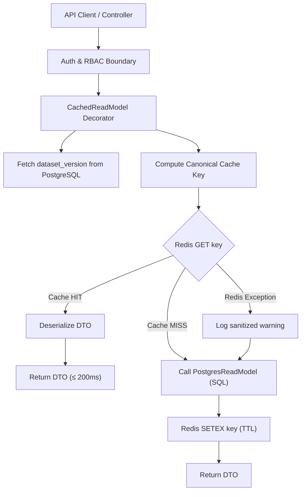
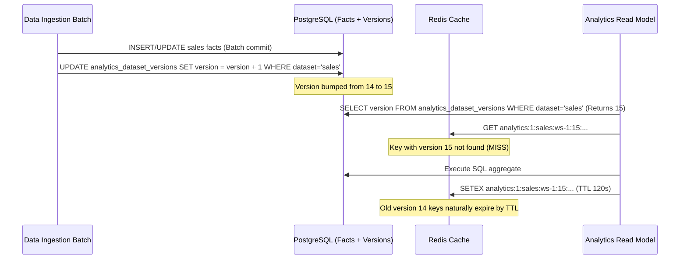

# Phase 16 — Analytics Cache Semantics & Invalidation Contract

## 1. Архитектурные принципы аналитического кэша

Слой кэширования в `lecar-bi` проектируется по принципу **Selective Versioned Cache** на границе интерфейсов чтения (`ReadModelInterface`).



### Фундаментальные правила:
1. **Кэш размещается строго за границей авторизации:** Кэширование происходит внутри инфраструктурных декораторов Read Model после успешной аутентификации пользователя, валидации принадлежности к `workspace_id` и проверки RBAC-полномочий.
2. **PostgreSQL — единственный источник истины:** Redis содержит исключительно производные, сериализованные DTO результатов чтения. Потеря, очистка или сбой Redis никогда не приводят к потере данных или изменению бизнес-результатов.
3. **Fail-Open отказоустойчивость:** Любая ошибка Redis (таймаут, отказ соединения, переполнение памяти) мягко деградирует производительность до времени прямого SQL-запроса, не возвращая ошибку 500 клиенту.
4. **Семантическая эквивалентность (Parity 100%):** Ответы из прогретого кэша (`warm`), при промахе кэша (`cold`) и при отключенном кэше (`disabled`) абсолютно идентичны по составу данных, типам и точности округления чисел.

---

## 2. Белый список кэширования (Cache Allowlist) и TTL

В кэш допускаются исключительно детерминированные, повторяемые агрегаты с низкой кардинальностью параметров.

### Таблица разрешенных операций (Allowlist)

| Модуль | Метод Read Model | Назначение | Default TTL | Обоснование включения |
|---|---|---|---:|---|
| **Sales Analytics** | `getSalesOverview` | Сводные KPI продаж (выручка, заказы, средний чек, динамика) | **120 с** | Высокая частота запросов виджетами дашборда, тяжелая агрегация по 100k+ строк |
| **Sales Analytics** | `getFilterOptions` | Справочник доступных фильтров (категории, регионы, даты) | **300 с** | Низкая частота изменений справочников, частые повторные запросы клиентами |
| **Inventory Analytics** | `getInventorySummary` | Сводка состояния складских запасов и классификация дефицита | **120 с** | Дорогой расчет среза последних снимков остатков, повторные запросы виджетами |
| **Inventory Analytics** | `getFilterOptions` | Справочник фильтров складов и категорий запасов | **300 с** | Статичные метаданные складов и товарных групп |
| **Inventory Analytics** | `getAbcXyzSummary` | Сводная матрица Парето и стабильности спроса (AX..CZ) | **120 с** | Вычисление вариации и накопительных долей спроса по всем товарам за 90 дней |
| **Supplier Analytics** | `getSupplierOverview` | Сводка надежности и затрат на поставщиков | **120 с** | Комплексная агрегация своевременности поставок и объемов за период |
| **Supplier Analytics** | `getFilterOptions` | Справочник поставщиков, складов и статусов поставок | **300 с** | Метаданные справочника поставщиков и складов |

---

## 3. Запрет кэширования высококардинальных операций (Non-Cached Operations)

Следующие методы Read Model и операции **категорически запрещено кэшировать** в Redis:

| Метод / Тип операции | Причина исключения из кэширования |
|---|---|
| `SalesAnalyticsReadModel::getSalesRecords` | **Высокая кардинальность:** бесконечные комбинации параметров поиска, сортировок по колонкам (`sortBy`, `sortDirection`), диапазонов дат и номеров страниц (`page`, `perPage`). Низкий hit-rate (<1%), засорение памяти Redis (cache pollution). |
| `InventoryAnalyticsReadModel::getInventoryItems` | Высокая комбинаторика текстового поиска (`search`), фильтров по здоровью запаса и пагинации. |
| `InventoryAnalyticsReadModel::getAbcXyzItems` | Пагинированные списки товаров конкретных групп ABC/XYZ с динамической сортировкой. |
| `SupplierAnalyticsReadModel::getSupplierPerformance` | Пагинированный рейтинг поставщиков с фильтрацией по складам и поиском. |
| `SupplierAnalyticsReadModel::getSupplierDeliveries` | Пагинированный журнал 200 000+ поставок с фильтрацией по статусам и датам. |
| **Alert Lists & Notifications** | Критичность к задержке доставки алертов в реальном времени. |
| **Data Ingestion Status & Jobs** | Транзакционные статусы выполнения импорта, меняющиеся ежесекундно. |
| **Dashboard Configuration** | Низкая стоимость чтения одиночной строки конфигурации, отсутствие аналитических вычислений. |
| **Commands & Mutations** | Любые операции записи, изменения настроек или запуск пересчетов. |

---

## 4. Спецификация кэш-ключа (Cache Key Specification)

Формат ключа строго стандартизирован:

```
analytics:{schema_version}:{dataset}:{workspace_id}:{dataset_version}:{operation}:{criteria_hash}
```

### Составляющие сегменты ключа

1. `analytics` — статический глобальный префикс пространства имен аналитического кэша.
2. `{schema_version}` (int) — версия схемы сериализованного DTO (текущая версия: `1`). Инкрементируется при обратно несовместимых изменениях структуры DTO/JSON.
3. `{dataset}` (string) — аналитический домен: `sales`, `inventory` или `suppliers`.
4. `{workspace_id}` (string) — идентификатор рабочего пространства (гарантия строгой мультиарендной изоляции данных).
5. `{dataset_version}` (bigint) — текущая монотонная версия датасета из таблицы PostgreSQL `analytics_dataset_versions`.
6. `{operation}` (string) — каноническое имя операции в snake_case (`sales_overview`, `sales_filters`, `inventory_summary`, `inventory_filters`, `abc_xyz_summary`, `supplier_overview`, `supplier_filters`).
7. `{criteria_hash}` (string) — SHA-256 хеш канонизированного JSON-представления критериев запроса (`CanonicalCriteria`).

### Пример сформированного ключа
```
analytics:1:sales:perf-ws-1:14:sales_overview:a8f9c2d1e0b5437890abcdef1234567890abcdef1234567890abcdef12345678
```

### Канонизация критериев (`CanonicalCriteria`)
Для предотвращения дублирования кэша при разном порядке полей или эквивалентных значениях defaults:
1. Исключаются не влияющие на результат поля.
2. Все ключи массива сортируются лексикографически по возрастанию (`ksort`).
3. Явные `null` и значения по умолчанию приводятся к детерминированному виду (например, отсутствие фильтра и `null` эквивалентны).
4. Даты нормализуются к строгому формату `YYYY-MM-DD`.
5. Массив преобразуется в JSON с флагами `JSON_UNESCAPED_SLASHES | JSON_UNESCAPED_UNICODE`.
6. Категорически запрещено использовать нативный PHP `serialize()` от входящих DTO из-за чувствительности к внутренним именам классов и типам.

### Учет прав доступа и ролей (RBAC Context)
Согласно архитектурным правилам Phase 15, аналитический payload агрегатов идентичен для всех допущенных к чтению ролей внутри одного `workspace_id`. Поэтому `user_id` **не включается** в кэш-ключ, обеспечивая максимальный hit-rate между пользователями одной компании. Если в будущих фазах появится разделение видимости полей (field-level security), в ключ будет добавлен `capability_fingerprint`.

---

## 5. Архитектура инвалидации: Версионирование датасетов

> [!IMPORTANT]
> **Никаких `Cache::flush()`, Redis `KEYS *` или Redis `SCAN`.**
> Массовый поиск ключей в Redis блокирует однопоточный event-loop сервера, а тегирование ключей (Redis Tags) не поддерживается стандартным Redis без создания сложных вспомогательных сетов.

Вместо удаления ключей применяется **монотонное версионирование датасетов** в PostgreSQL.



### Таблица версий датасетов (`analytics_dataset_versions`)

```sql
CREATE TABLE analytics_dataset_versions (
    workspace_id VARCHAR(64) NOT NULL,
    dataset VARCHAR(32) NOT NULL,
    version BIGINT NOT NULL DEFAULT 1,
    updated_at TIMESTAMP NOT NULL DEFAULT CURRENT_TIMESTAMP,
    PRIMARY KEY (workspace_id, dataset)
);
```

### Триггеры инкремента версии:
1. **Data Ingestion (Sales / Inventory / Supplier):**
   - По завершении успешного импорта пакета фактов (если вставлена или обновлена хотя бы одна запись).
   - При частичном успехе батча (**partial-success**), если часть фактов была записана в базу данных.
   - Инкремент выполняется ровно **один раз на батч** в конце транзакции импорта.
2. **Seeders (Demo & Performance):**
   - `DemoDataSeeder` и `PerformanceDatasetSeeder` выполняют инкремент версий соответствующих датасетов после вставки данных.
3. **Projection Rebuild Jobs (при наличии):**
   - Задача перестроения проекции сначала атомарно коммитит новые агрегатные таблицы, и только после этого увеличивает версию датасета.

### Изоляция инвалидации:
- Изменение данных продаж (`sales`) увеличивает версию только датасета `sales` и не затрагивает кэш `inventory` или `suppliers`.
- Инкремент версии в `perf-ws-1` не затрагивает версии и кэш рабочих пространств `ws-1` или `ws-2`.
- Старые ключи предыдущей версии датасета становятся недостижимыми (unreachable) и освобождаются памятью Redis автоматически по истечении их TTL (120–300 секунд).

---

## 6. Отказоустойчивость и безопасность (Fail-Open Semantics)

Декораторы кэша оборачивают операции чтения и записи в блоки перехвата исключений:

```php
try {
    $cached = $this->cache->get($cacheKey);
    if ($cached !== null) {
        return $cached;
    }
} catch (\Throwable $e) {
    $this->logger->warning('Analytics cache read failure; falling back to PostgreSQL', [
        'dataset' => $dataset,
        'workspace_id' => $workspaceId,
        'operation' => $operation,
        'exception' => get_class($e),
    ]);
}

// Прямой вызов PostgreSQL Read Model при промахе или ошибке Redis
$result = $this->delegate->getSalesOverview($workspaceId, $criteria);

try {
    $this->cache->put($cacheKey, $result, $ttlSeconds);
} catch (\Throwable $e) {
    $this->logger->warning('Analytics cache write failure; result returned uncached', [
        'dataset' => $dataset,
        'workspace_id' => $workspaceId,
        'operation' => $operation,
        'exception' => get_class($e),
    ]);
}

return $result;
```

### Правила санитарного логирования:
- Запрещено логировать тело ответа, персональные данные, заголовки авторизации или реальные значения SQL-параметров.
- Логируются только технические метаданные: имя датасета, идентификатор workspace, имя метода и класс ошибки (`RedisException`, `ConnectionException`).
- Ошибки выполнения SQL-запросов и доменные исключения PostgreSQL **не перехватываются и не маскируются** кэш-слоем.
