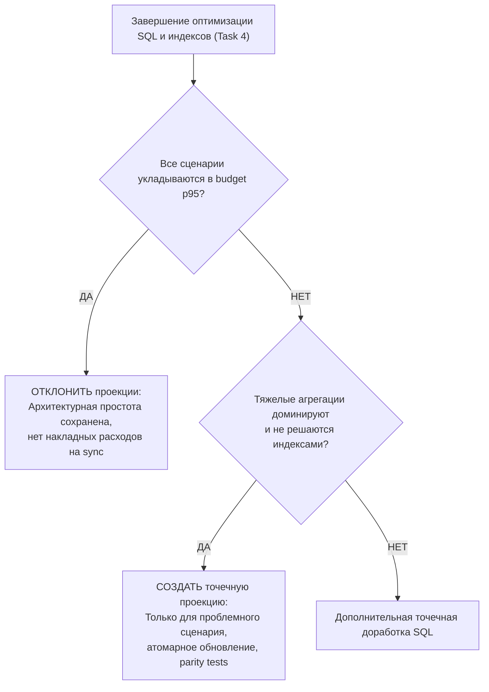

# Phase 16 — Performance Optimization Report & Decision Ledger

## 1. Назначение и методология отчета

Данный документ является центральным журналом оптимизаций, фиксации замеров и архитектурных решений Phase 16. Он наполняется по мере прохождения этапов:
- **Task 3:** Снятие Baseline замеров на профиле `large` (cache disabled), выявление bottlenecks.
- **Task 4:** Оптимизация SQL-запросов, декомпозиция `PostgresInventoryAnalyticsReadModel` и добавление покрывающих индексов.
- **Task 5:** Обоснованное решение по созданию или отказу от материализованных представлений / аналитических проекций.
- **Task 6:** Внедрение версионированного селективного кэша в Redis и замеры попаданий (`warm cache`).
- **Task 7:** Оценка необходимости request-scoped promise coalescing на фронтенде для дашборда.
- **Task 8–9:** Итоговые регрессионные проверки, верификация parity и закрытие фазы.

---

## 2. Предварительно идентифицированные кандидаты в Bottlenecks

До проведения baseline-замеров на основе анализа исходного кода выделены следующие подозрительные участки:

### 1. In-memory сортировка и пагинация в `PostgresSupplierAnalyticsReadModel`
- **Проблема:** Метод `getSupplierPerformance` вычитывает агрегаты по всем поставщикам в массив PHP, выполняет сортировку средствами `usort()` и делает слайс `array_slice()` для пагинации.
- **Риск на датасете `large`:** Рост расхода памяти PHP и деградация времени выполнения пропорционально числу поставщиков и объёму поставок.
- **План Task 4:** Перенос `ORDER BY` и `LIMIT / OFFSET` непосредственно в SQL-запрос с оконными функциями или агрегатными подзапросами.

### 2. In-memory классификация ABC/XYZ в `PostgresInventoryAnalyticsReadModel`
- **Проблема:** Метод `getAbcXyzItems` и `getAbcXyzSummary` загружает данные по продажам всех активных товаров в память PHP, вычисляет накопительные проценты выручки для категорий A/B/C и коэффициенты вариации для X/Y/Z в цикле PHP.
- **Риск на датасете `large`:** При 10 000 товаров обработка полного массива в PHP создает задержку, превышающую бюджет 1 500 ms, и нерационально расходует RAM.
- **План Task 4 / 5:** Оптимизация через оконные функции PostgreSQL (`SUM() OVER (ORDER BY revenue DESC)`) либо создание легковесной периодической проекции при превышении бюджета.

### 3. Дублирующиеся подзапросы поиска актуального снимка остатков (`latest snapshot`)
- **Проблема:** Запросы сводки остатков и позиций многократно сканируют таблицу `inventory_snapshots` (500 000 строк) коррелированными подзапросами вида `WHERE snapshot_date = (SELECT MAX(snapshot_date)...)`.
- **Риск на датасете `large`:** Повторные Seq Scan или Bitmap Scan по полумиллиону строк на каждый запрос сводки.
- **План Task 4:** Использование CTE или детерминированного оконного фильтра `DISTINCT ON (warehouse_id, product_id)` с композитным индексом `(workspace_id, warehouse_id, product_id, snapshot_date DESC)`.

### 4. Монолитный размер `PostgresInventoryAnalyticsReadModel.php`
- **Проблема:** Класс превышает 700 строк кода, совмещая логику сводки, поиска позиций, фильтров и двух сложных режимов ABC/XYZ.
- **План Task 4:** Декомпозиция фасада на специализированные query-классы (`InventorySummaryQuery`, `InventoryItemsQuery`, `AbcXyzSummaryQuery`, `AbcXyzItemsQuery`) с сохранением единого интерфейса `InventoryAnalyticsReadModelInterface`.

---

## 3. Сводная таблица Before / After по сценариям (Scenario Ledger)

*Таблица заполняется по результатам Tasks 3, 4, 6 и 8. Бюджеты зафиксированы до начала оптимизаций.*

| Scenario ID | Метод / Сценарий | Бюджет p95 | Baseline p95 (T3) | After SQL p95 (T4) | Warm Cache p95 (T6) | Статус |
|---|---|---:|---:|---:|---:|---|
| **SALES-01** | Sales Overview (Default) | ≤ 1 000 ms | *T3* | *T4* | *T6* | PENDING |
| **SALES-02** | Sales Overview (Selective) | ≤ 1 000 ms | *T3* | *T4* | *T6* | PENDING |
| **SALES-03** | Sales Filter Options | ≤ 1 000 ms | *T3* | *T4* | *T6* | PENDING |
| **SALES-04** | Sales Records (Default Page 1) | ≤ 1 500 ms | *T3* | *T4* | *N/A (no cache)*| PENDING |
| **SALES-05** | Sales Records (Selective Page 5)| ≤ 1 500 ms | *T3* | *T4* | *N/A (no cache)*| PENDING |
| **INV-01** | Inventory Summary (Default) | ≤ 1 000 ms | *T3* | *T4* | *T6* | PENDING |
| **INV-02** | Inventory Summary (Selective) | ≤ 1 000 ms | *T3* | *T4* | *T6* | PENDING |
| **INV-03** | Inventory Filter Options | ≤ 1 000 ms | *T3* | *T4* | *T6* | PENDING |
| **INV-04** | Inventory Items (Default Page 1)| ≤ 1 500 ms | *T3* | *T4* | *N/A (no cache)*| PENDING |
| **INV-05** | Inventory Items (Selective) | ≤ 1 500 ms | *T3* | *T4* | *N/A (no cache)*| PENDING |
| **INV-06** | ABC/XYZ Summary (Default 90d) | ≤ 1 000 ms | *T3* | *T4* | *T6* | PENDING |
| **INV-07** | ABC/XYZ Summary (Selective) | ≤ 1 000 ms | *T3* | *T4* | *T6* | PENDING |
| **INV-08** | ABC/XYZ Items (Group AX Page 1) | ≤ 1 500 ms | *T3* | *T4* | *N/A (no cache)*| PENDING |
| **INV-09** | ABC/XYZ Items (Selective) | ≤ 1 500 ms | *T3* | *T4* | *N/A (no cache)*| PENDING |
| **SUP-01** | Supplier Overview (Default) | ≤ 1 000 ms | *T3* | *T4* | *T6* | PENDING |
| **SUP-02** | Supplier Overview (Selective) | ≤ 1 000 ms | *T3* | *T4* | *T6* | PENDING |
| **SUP-03** | Supplier Filter Options | ≤ 1 000 ms | *T3* | *T4* | *T6* | PENDING |
| **SUP-04** | Supplier Performance (Page 1) | ≤ 1 500 ms | *T3* | *T4* | *N/A (no cache)*| PENDING |
| **SUP-05** | Supplier Performance (Selective)| ≤ 1 500 ms | *T3* | *T4* | *N/A (no cache)*| PENDING |
| **SUP-06** | Supplier Deliveries (Page 1) | ≤ 1 500 ms | *T3* | *T4* | *N/A (no cache)*| PENDING |
| **SUP-07** | Supplier Deliveries (Selective) | ≤ 1 500 ms | *T3* | *T4* | *N/A (no cache)*| PENDING |
| **DASH-01** | Executive Dashboard Fan-out | ≤ 2 000 ms | *T3* | *T4* | *T6* | PENDING |
| **DASH-02** | Dashboard Duplicate Aggregates | ≤ 2 000 ms | *T3* | *T4* | *T6* | PENDING |

---

## 4. Сравнение метрик движка PostgreSQL (Engine Metrics Before / After)

| Scenario ID | Состояние | Rows Examined | Shared Hits | Shared Reads | Temp Files / Bytes | Sort Method | Dominant Plan Nodes |
|---|---|---:|---:|---:|---:|---|---|
| *T3 Target* | Before (T3) | *T3* | *T3* | *T3* | *T3* | *T3* | *T3* |
| *T4 Target* | After (T4) | *T4* | *T4* | *T4* | *T4* | *T4* | *T4* |

---

## 5. Журнал добавления индексов (Index Evolution Log)

Каждый индекс, добавляемый в Task 4, обязан быть зафиксирован в данном журнале с привязкой к сценарию и подтвержден планом `EXPLAIN`:

```markdown
### Index Candidate: [idx_name]
- **Таблица:** `sales_orders` / `sales_order_items` / etc.
- **Определение:** `CREATE INDEX CONCURRENTLY ... ON ... (workspace_id, ...);`
- **Обосновывающий сценарий:** SALES-02 / INV-01 / etc.
- **Проблема в плане Before:** Seq Scan по 300 000 строкам, Filter: (order_date >= ...).
- **Результат в плане After:** Index Scan с предварительной фильтрацией по workspace_id.
- **Откат (Rollback):** `DROP INDEX CONCURRENTLY IF EXISTS [idx_name];`
```

---

## 6. Фреймворк решения по материализованным представлениям / проекциям (Task 5 Gate)

В Task 5 принимается строго обоснованное решение:



### Критерии обоснования проекции:
1. Оптимизация SQL и добавление индексов не позволили достичь бюджета (p95 > 1 000 ms для summary или > 1 500 ms для ABC/XYZ).
2. Затраты на пересчет проекции при импорте меньше, чем суммарная экономия времени чтения.
3. Проекция имеет детерминированный механизм инвалидации и parity-тесты.
4. В случае отклонения в данный отчет заносится запись: **«Решение: Проекция отклонена на основе замеров. Бюджеты достигнуты оптимизацией SQL и композитными индексами»**.

---

## 7. Фреймворк оценки Front-end Request Coalescing (Task 7 Gate)

- **Правило:** Постоянный кэш на стороне фронтенда (Local Storage / React Query cache между сессиями / сессионный стор) **запрещен**.
- **Условие включения Coalescing:** Если при рендере нескольких виджетов одного экрана возникают идентичные параллельные HTTP-запросы в рамках одного render cycle, в `widget-data-loader.ts` добавляется только request-scoped promise coalescing.
- В случае, если warm cache в Redis уже обеспечивает время отклика ≤ 200 ms и суммарный fan-out укладывается в 2 000 ms, фронтенд-код остается без изменений.

---

## 8. Оценка компромиссов и накладных расходов (Trade-offs Analysis)

- **Потребление оперативной памяти Redis:**
  - Оценка количества одновременно хранящихся ключей: ~50 ключей на активный workspace (с учетом комбинаций базовых фильтров).
  - Средний размер сериализованного JSON DTO: ~2–15 KB.
  - Потребление RAM на 1 000 активных workspaces: ~15–50 MB (в пределах выделенного лимита 512 MB).
- **Накладные расходы на запись (Write Amplification):**
  - Добавление композитных индексов ускоряет чтение, но может незначительно увеличить время batch insert при импорте в Data Ingestion.
  - Обязателен замер скорости работы `ProcessImportBatchHandler` до и после создания индексов.
