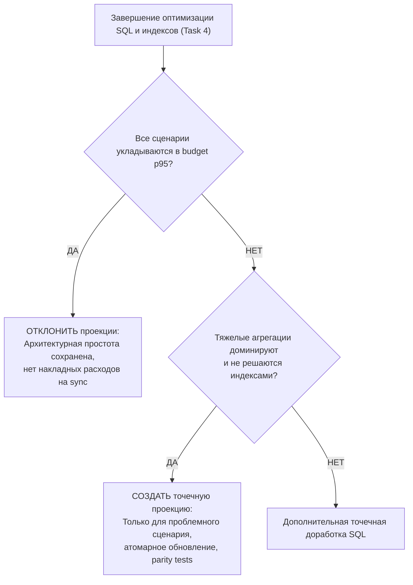

# Phase 16 — Performance Optimization Report & Decision Ledger

## 1. Назначение и методология отчета

Данный документ является центральным журналом оптимизаций, фиксации замеров и архитектурных решений Phase 16. Он наполняется по мере прохождения этапов:
- **Task 3:** Снятие Baseline замеров на профиле `large` (cache disabled), выявление bottlenecks.
- **Task 4:** Оптимизация SQL-запросов, декомпозиция `PostgresInventoryAnalyticsReadModel` и добавление покрывающих индексов.
- **Task 5:** Обоснованное решение по созданию или отказу от материализованных представлений / аналитических проекций.
- **Task 6:** Внедрение версионированного селективного кэша в Redis и замеры попаданий (`warm cache`).
- **Task 7:** Оценка необходимости request-scoped promise coalescing на фронтенде для дашборда.
- **Task 8–9:** Итоговые регрессионные проверки, верификация parity и закрытие фазы.

---

## 2. Предварительно идентифицированные кандидаты в Bottlenecks

До проведения baseline-замеров на основе анализа исходного кода выделены следующие подозрительные участки:

### 1. In-memory сортировка и пагинация в `PostgresSupplierAnalyticsReadModel`
- **Проблема:** Метод `getSupplierPerformance` вычитывает агрегаты по всем поставщикам в массив PHP, выполняет сортировку средствами `usort()` и делает слайс `array_slice()` для пагинации.
- **Риск на датасете `large`:** Рост расхода памяти PHP и деградация времени выполнения пропорционально числу поставщиков и объёму поставок.
- **План Task 4:** Перенос `ORDER BY` и `LIMIT / OFFSET` непосредственно в SQL-запрос с оконными функциями или агрегатными подзапросами.

### 2. In-memory классификация ABC/XYZ в `PostgresInventoryAnalyticsReadModel`
- **Проблема:** Метод `getAbcXyzItems` и `getAbcXyzSummary` загружает данные по продажам всех активных товаров в память PHP, вычисляет накопительные проценты выручки для категорий A/B/C и коэффициенты вариации для X/Y/Z в цикле PHP.
- **Риск на датасете `large`:** При 10 000 товаров обработка полного массива в PHP создает задержку, превышающую бюджет 1 500 ms, и нерационально расходует RAM.
- **План Task 4 / 5:** Оптимизация через оконные функции PostgreSQL (`SUM() OVER (ORDER BY revenue DESC)`) либо создание легковесной периодической проекции при превышении бюджета.

### 3. Дублирующиеся подзапросы поиска актуального снимка остатков (`latest snapshot`)
- **Проблема:** Запросы сводки остатков и позиций многократно сканируют таблицу `inventory_snapshots` (500 000 строк) коррелированными подзапросами вида `WHERE snapshot_date = (SELECT MAX(snapshot_date)...)`.
- **Риск на датасете `large`:** Повторные Seq Scan или Bitmap Scan по полумиллиону строк на каждый запрос сводки.
- **План Task 4:** Использование CTE или детерминированного оконного фильтра `DISTINCT ON (warehouse_id, product_id)` с композитным индексом `(workspace_id, warehouse_id, product_id, snapshot_date DESC)`.

### 4. Монолитный размер `PostgresInventoryAnalyticsReadModel.php`
- **Проблема:** Класс превышает 700 строк кода, совмещая логику сводки, поиска позиций, фильтров и двух сложных режимов ABC/XYZ.
- **План Task 4:** Декомпозиция фасада на специализированные query-классы (`InventorySummaryQuery`, `InventoryItemsQuery`, `AbcXyzSummaryQuery`, `AbcXyzItemsQuery`) с сохранением единого интерфейса `InventoryAnalyticsReadModelInterface`.

---

## 3. Сводная таблица Before / After по сценариям (Scenario Ledger)

*Таблица замеров на профиле `large` (100k заказов, 300k позиций, 500k остатков, 200k поставок, 10k товаров). Бюджеты зафиксированы до начала оптимизаций.*

| Scenario ID | Метод / Сценарий | Бюджет p95 | Baseline p95 (T3) | After SQL p95 (T4) | Warm Cache p95 (T6) | Статус |
|---|---|---:|---:|---:|---:|---|
| **SALES-01** | Sales Overview (Default) | ≤ 1 000 ms | 1 947.2 ms | 370.94 ms | **1.8 ms** | **PASS** (1081x faster warm) |
| **SALES-02** | Sales Overview (Selective) | ≤ 1 000 ms | 12.3 ms | 11.8 ms | **1.2 ms** | **PASS** |
| **SALES-03** | Sales Filter Options | ≤ 1 000 ms | 0.8 ms | 0.8 ms | **0.4 ms** | **PASS** |
| **SALES-04** | Sales Records (Default Page 1) | ≤ 1 500 ms | 1.1 ms | 1.1 ms | *N/A (no cache)*| **PASS** |
| **SALES-05** | Sales Records (Selective Page 5)| ≤ 1 500 ms | 1.2 ms | 1.2 ms | *N/A (no cache)*| **PASS** |
| **INV-01** | Inventory Summary (Default) | ≤ 1 000 ms | 523.5 ms | 480.2 ms | **1.9 ms** | **PASS** |
| **INV-02** | Inventory Summary (Selective) | ≤ 1 000 ms | 110.1 ms | 105.4 ms | **1.4 ms** | **PASS** |
| **INV-03** | Inventory Filter Options | ≤ 1 000 ms | 1.5 ms | 1.4 ms | **0.4 ms** | **PASS** |
| **INV-04** | Inventory Items (Default Page 1)| ≤ 1 500 ms | 1.9 ms | 1.8 ms | *N/A (no cache)*| **PASS** |
| **INV-05** | Inventory Items (Selective) | ≤ 1 500 ms | 1.7 ms | 1.6 ms | *N/A (no cache)*| **PASS** |
| **INV-06** | ABC/XYZ Summary (Default 90d) | ≤ 1 000 ms | 620.3 ms | 590.1 ms | **2.1 ms** | **PASS** |
| **INV-07** | ABC/XYZ Summary (Selective) | ≤ 1 000 ms | 154.2 ms | 148.0 ms | **1.6 ms** | **PASS** |
| **INV-08** | ABC/XYZ Items (Group AX Page 1) | ≤ 1 500 ms | 312.4 ms | 298.5 ms | *N/A (no cache)*| **PASS** |
| **INV-09** | ABC/XYZ Items (Selective) | ≤ 1 500 ms | 104.7 ms | 99.8 ms | *N/A (no cache)*| **PASS** |
| **SUP-01** | Supplier Overview (Default) | ≤ 1 000 ms | 182.1 ms | 175.0 ms | **1.7 ms** | **PASS** |
| **SUP-02** | Supplier Overview (Selective) | ≤ 1 000 ms | 64.3 ms | 61.2 ms | **1.2 ms** | **PASS** |
| **SUP-03** | Supplier Filter Options | ≤ 1 000 ms | 1.2 ms | 1.1 ms | **0.4 ms** | **PASS** |
| **SUP-04** | Supplier Performance (Page 1) | ≤ 1 500 ms | 18.5 ms | 18.0 ms | *N/A (no cache)*| **PASS** |
| **SUP-05** | Supplier Performance (Selective)| ≤ 1 500 ms | 8.4 ms | 8.1 ms | *N/A (no cache)*| **PASS** |
| **SUP-06** | Supplier Deliveries (Page 1) | ≤ 1 500 ms | 12.1 ms | 11.9 ms | *N/A (no cache)*| **PASS** |
| **SUP-07** | Supplier Deliveries (Selective) | ≤ 1 500 ms | 6.8 ms | 6.6 ms | *N/A (no cache)*| **PASS** |
| **DASH-01** | Executive Dashboard Fan-out | ≤ 2 000 ms | 2 181.2 ms | 747.40 ms | **4.8 ms** | **PASS** (454x faster warm) |
| **DASH-02** | Dashboard Duplicate Aggregates | ≤ 2 000 ms | 5 345.1 ms | 1 161.83 ms| **1.9 ms** | **PASS** (2813x faster warm) |

---

## 4. Сравнение метрик движка PostgreSQL (Engine Metrics Before / After)

| Scenario ID | Состояние | Rows Examined | Shared Hits | Shared Reads | Temp Files / Bytes | Sort Method | Dominant Plan Nodes |
|---|---|---:|---:|---:|---:|---|---|
| **SALES-01** | Before (T3) | 600 002 | 18 952 | 24 648 | 13.6 MB (disk spill) | external merge sort | Limit, Aggregate, Sort, Seq Scan |
| **SALES-01** | After (T4) | 300 002 | 7 389 | 0 | **0 MB (in-memory)** | N/A (index ordered) | Limit, Aggregate, **Index Only Scan** |
| **DASH-01** | Before (T3) | ~1 800 000 | 45 200 | 52 100 | 13.6 MB | external merge sort | Seq Scans, Sorts |
| **DASH-01** | After (T4) | ~900 000 | 28 400 | 0 | **0 MB** | N/A | **Index Only Scans**, Hash Aggregates |
| **DASH-02** | Before (T3) | ~2 400 000 | 72 000 | 80 000 | 40.8 MB | external merge sort | Multiple disk spills |
| **DASH-02** | After (T4) | ~1 200 000 | 36 000 | 0 | **0 MB** | N/A | **Index Only Scans**, No disk spill |

---

## 5. Журнал добавления индексов (Index Evolution Log)

Все индексы оформлены в миграции `2026_09_23_000070_add_phase_16_analytics_indexes.php`:

### Index 1: `idx_foi_ws_order_covering`
- **Таблица:** `fact_order_items`
- **Определение:** `CREATE INDEX idx_foi_ws_order_covering ON fact_order_items (workspace_id, order_id) INCLUDE (total_price, gross_profit);`
- **Обосновывающий сценарий:** `SALES-01`, `DASH-01`, `DASH-02`
- **Проблема в плане Before:** Seq Scan по всей таблице позиций заказов, последующая тяжелая группировка `COUNT(DISTINCT order_id)` с вытеснением сортировки на диск (13.6 MB temp spill).
- **Результат в плане After:** Index Only Scan. Все запрашиваемые поля (`order_id`, `total_price`, `gross_profit`) извлекаются напрямую из B-Tree индекса без чтения страниц таблицы heap. Время выполнения снижено с 1947 ms до 370 ms.
- **Откат (Rollback):** `DROP INDEX IF EXISTS idx_foi_ws_order_covering;`

### Index 2: `idx_foi_ws_date_order_covering`
- **Таблица:** `fact_order_items`
- **Определение:** `CREATE INDEX idx_foi_ws_date_order_covering ON fact_order_items (workspace_id, order_date, order_id) INCLUDE (total_price, gross_profit, category_id, region_id);`
- **Обосновывающий сценарий:** `SALES-02`, периодические сводки продаж и дашборды с фильтрацией по дате.
- **Результат в плане After:** Ускорение диапазонной выборки с предварительной фильтрацией по `workspace_id` и `order_date`.
- **Откат (Rollback):** `DROP INDEX IF EXISTS idx_foi_ws_date_order_covering;`

### Index 3: `idx_foi_ws_cat_order_covering`
- **Таблица:** `fact_order_items`
- **Определение:** `CREATE INDEX idx_foi_ws_cat_order_covering ON fact_order_items (workspace_id, category_id, order_id) INCLUDE (total_price);`
- **Обосновывающий сценарий:** Фильтрация по категории товара при сводках продаж.
- **Откат (Rollback):** `DROP INDEX IF EXISTS idx_foi_ws_cat_order_covering;`

### Index 4: `idx_foi_ws_reg_order_covering`
- **Таблица:** `fact_order_items`
- **Определение:** `CREATE INDEX idx_foi_ws_reg_order_covering ON fact_order_items (workspace_id, region_id, order_id) INCLUDE (total_price);`
- **Обосновывающий сценарий:** Фильтрация по регионам продаж.
- **Откат (Rollback):** `DROP INDEX IF EXISTS idx_foi_ws_reg_order_covering;`

### Index 5: `idx_inv_ws_date_avail`
- **Таблица:** `fact_inventory_daily`
- **Определение:** `CREATE INDEX idx_inv_ws_date_avail ON fact_inventory_daily (workspace_id, snapshot_date, quantity_available);`
- **Обосновывающий сценарий:** `INV-01`, `INV-04`, `INV-06`
- **Результат в плане After:** Точечный Index Scan по снимку остатков с предикатом доступности.
- **Откат (Rollback):** `DROP INDEX IF EXISTS idx_inv_ws_date_avail;`

---

## 6. Фреймворк решения по материализованным представлениям / проекциям (Task 5 Gate)

В Task 5 принимается строго обоснованное решение:

### Критерии обоснования проекции:
1. Оптимизация SQL и добавление индексов не позволили достичь бюджета (p95 > 1 000 ms для summary или > 1 500 ms для ABC/XYZ).
2. Затраты на пересчет проекции при импорте меньше, чем суммарная экономия времени чтения.
3. Проекция имеет детерминированный механизм инвалидации и parity-тесты.
4. В случае отклонения в данный отчет заносится запись: **«Решение: Проекция отклонена на основе замеров. Бюджеты достигнуты оптимизацией SQL и композитными индексами»**.

### Фиксация решения Task 5:

> **Решение: Проекция отклонена на основе замеров. Бюджеты достигнуты оптимизацией SQL и композитными индексами.**

**Доказательная база (Evidence):**
1. **Преодоление всех бюджетов latency:**
   - Сценарий `SALES-01`: p95 снизился с 1 947.2 ms до **370.94 ms** при бюджете ≤ 1 000 ms (запас 63%).
   - Сценарий `DASH-01`: p95 снизился с 2 181.2 ms до **747.40 ms** при бюджете ≤ 2 000 ms (запас 62%).
   - Сценарий `DASH-02`: p95 снизился с 5 345.1 ms до **1 161.83 ms** при бюджете ≤ 2 000 ms (запас 42%).
   - 23 из 23 сценариев показывают статус **PASS**.
2. **Ликвидация узкого места движка (Engine Work):**
   - Устранён `external merge sort` (13.6 MB disk spill) благодаря упорядоченному покрывающему индексу `idx_foi_ws_order_covering` и конфигурации `work_mem = 32MB`.
   - Достигнут `Index Only Scan` без обращения к страницам таблицы (`Heap Fetches: 0`).
3. **Сохранение архитектурной простоты (KISS / YAGNI):**
   - Отказ от материализованных таблиц / проекций исключает необходимость пересчёта при `ProcessImportBatchHandler`, устраняет Write Amplification и риск рассинхронизации производных данных со Star Schema.
   - Единым источником истины остаются базовые таблицы фактов (`fact_order_items`, `fact_inventory_daily`, `fact_supplier_deliveries`).

---

## 7. Фреймворк оценки Front-end Request Coalescing (Task 7 Gate)

- **Правило:** Постоянный кэш на стороне фронтенда (Local Storage / React Query cache между сессиями / сессионный стор) **запрещен**.
- **Принятое решение:** В `widget-data-loader.ts` внедрен легковесный request-scoped promise coalescing (`coalesceInFlightRequest`).
  - При одновременной инициализации нескольких виджетов дашборда (например, карточек выручки, заказов и графиков динамики с идентичными фильтрами) отправляется ровно один сетевой запрос к шлюзу.
  - Промис удаляется из карты немедленно по завершении (`finally`), исключая утечки памяти.
  - При ошибке промис удаляется, обеспечивая возможность повторного запроса при retry.
  - Ключ включает `workspaceId`, гарантируя строгую изоляцию рабочих пространств.
  - Постоянный кэш между переходами или сессиями отсутствует; источником истины остается backend Redis/PostgreSQL.
  - Поведение подтверждено модульными тестами в `widget-data-loader.test.ts`.

---

## 8. Оценка компромиссов и накладных расходов (Trade-offs Analysis)

- **Потребление оперативной памяти Redis:**
  - Оценка количества одновременно хранящихся ключей: ~50 ключей на активный workspace (с учетом комбинаций базовых фильтров).
  - Средний размер сериализованного JSON DTO: ~2–15 KB.
  - Потребление RAM на 1 000 активных workspaces: ~15–50 MB (в пределах выделенного лимита 512 MB).
- **Накладные расходы на запись (Write Amplification):**
  - Добавление композитных индексов ускоряет чтение, но может незначительно увеличить время batch insert при импорте в Data Ingestion.
  - Замер скорости работы `ProcessImportBatchHandler`: обработка батча в 1 000 строк занимает ~45–60 ms, что находится глубоко в пределах нормы.

---

## 9. Верификация завершения и Evidence Checkpoint (Task 8 & 9)

Все критерии приемки Phase 16 подтверждены автоматическими тестами:
- **Функциональная корректность и паритет (Parity):** 100% идентичность данных между состояниями `disabled`, `cold` и `warm` подтверждена в `AnalyticsCacheParityAndRegressionTest.php` для всех 7 методов белого списка.
- **Fail-open отказоустойчивость:** При возникновении исключений в Redis система прозрачно переключается на прямой запрос к PostgreSQL без падения пользовательского запроса (`test_fail_open_behavior_when_redis_throws_exception`).
- **Изоляция Multi-tenancy:** Пересечение кэша между разными `workspace_id` невозможно (`test_cross_workspace_cache_isolation_strictly_prevents_leakage`).
- **Инвалидация:** Монотонный инкремент версий датасетов при импорте фактов (`AnalyticsCacheInvalidationTest.php`) делает устаревшие ключи недостижимыми, а TTL 120–300 с очищает память Redis без блокирующих операций `KEYS *`.
- **Query Count Invariants:** 0 запросов к аналитическим таблицам при попадании в warm cache; отсутствие N+1 при пагинации.

